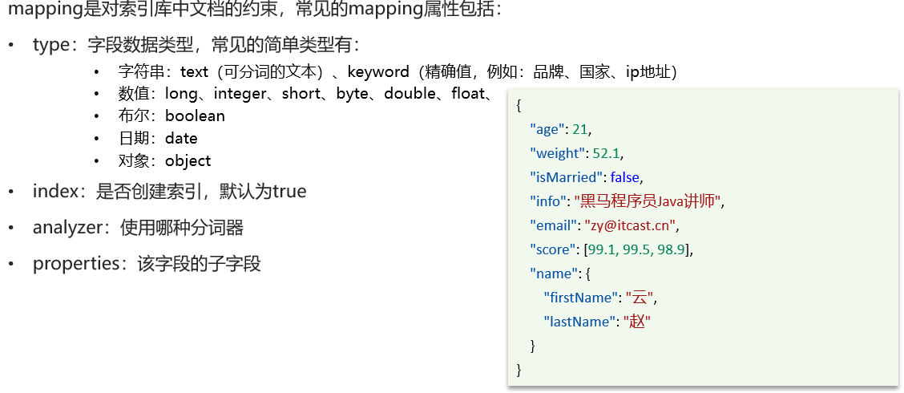

# ElasticSearch

## 基础部分

### 什么是elasticsearch？

一个开源的分布式搜索引擎，可以用来实现搜索、日志统计、分析、系统监控等功能

### 什么是elastic stack（ELK）？

是以elasticsearch为核心的技术栈，包括beats、Logstash、kibana、elasticsearch

### 什么是Lucene？

是Apache的开源搜索引擎类库，提供了搜索引擎的核心API

### 什么是文档和词条？

•每一条数据就是一个文档

•对文档中的内容分词，得到的词语就是词条

### 什么是正向索引？

•基于文档id创建索引。查询词条时必须先找到文档，而后判断是否包含词条

### 什么是倒排索引？

•对文档内容分词，对词条创建索引，并记录词条所在文档的信息。查询时先根据词条查询到文档id，而后获取到文档

### elasticsearch与数据库的关系：

•数据库负责事务类型操作

•elasticsearch负责海量数据的搜索、分析、计算

### 分词器的作用是什么？

•创建倒排索引时对文档分词

•用户搜索时，对输入的内容分词

### IK分词器有几种模式？

•ik_smart：智能切分，粗粒度

•ik_max_word：最细切分，细粒度

### IK分词器如何拓展词条？如何停用词条？

•利用config目录的IkAnalyzer.cfg.xml文件添加拓展词典和停用词典

•在词典中添加拓展词条或者停用词条

### mapping常见属性有哪些？

•type：数据类型

•index：是否索引

•analyzer：分词器

•properties：子字段

### type常见的有哪些？

•字符串：text、keyword

•数字：long、integer、short、byte、double、float

•布尔：boolean

•日期：date

•对象：object