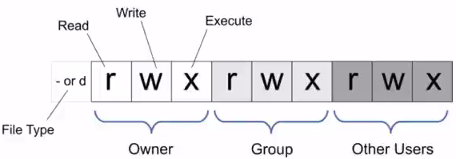
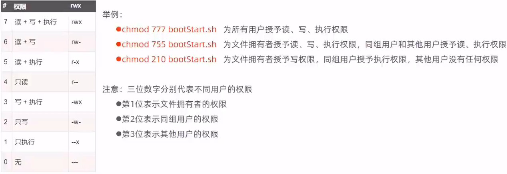

<<<<<<< HEAD
# Linux 

### 常用指令

#### 基础指令

##### 1、ls list 查看当前目录下的内容

ls [-al] [dir]

```
ls	  查看当前目录下的内容
ls -a 列出目录所有文件，包含以.开始的隐藏文件
ls -A 列出除.及..的其它文件
ls -r 反序排列
ls -t 以文件修改时间排序
ls -S 以文件大小排序
ls -h 以易读大小显示
ls -l 除了文件名之外，还将文件的权限、所有者、文件大小等信息详细列出来
```

##### 2、cd (changeDirectory) 切换目录

```
cd [目录名]
cd /	进入要目录
cd ~	进入 "home" 目录
cd -	进入上一次工作路径
cd ..	切换到上一级目录
cd !$	把上个命令的参数作为cd参数使用。
```

##### 3、pwd  查看当前工作目录路径

```
pwd		查看当前工作目录路径
pwd -P	查看软链接的实际路径
```

##### 4、mkdir 用于创建文件夹

```
mkdir [name]	当前工作目录下创建名为name的文件夹
mkdir -m	对新建目录设置存取权限，也可以用 chmod 命令设置
mkdir -p 	可以是一个路径名称。此时若路径中的某些目录尚不存在,加上此选项后，系统将自动建立好那些尚不在的目录，即一次可以建立多个目录。
```

##### 5、rm  删除一个目录中的一个或多个文件或目录

```
rm [选项] 文件…
rm -i *.log	删除任何 .log 文件，删除前逐一询问确认
rm -rf test	删除 test 子目录及子目录中所有档案删除，并且不用一一确认
rm -- -f*	删除以 -f 开头的文件
```

##### 6、touch 用于修改文件或者目录的时间属性，若不存在则新建

```
新建一个或多个文件文件夹
touch 1.txt 2.txt	新建两个文件
touch a b			新建两个文件夹
touch 	[-acfm][-d<日期时间>][-r<参考文件或目录>] [-t<日期时间>]
		[--help][--version][文件或目录…]
a 改变档案的读取时间记录。
m 改变档案的修改时间记录。
c 假如目的档案不存在，不会建立新的档案。与 --no-create 的效果一样。
f 不使用，是为了与其他 unix 系统的相容性而保留。
r 使用参考档的时间记录，与 --file 的效果一样。
d 设定时间与日期，可以使用各种不同的格式。
t 设定档案的时间记录，格式与 date 指令相同。
--no-create 不会建立新档案。
--help 列出指令格式。
--version 列出版本讯息。

```

##### 7、rmdir 从一个目录中删除一个或多个子目录项，必须具有对其父目录的写权限

```
rmdir -p parent/child/child11	当 parent 子目录被删除后使它也成为空目录的话，则顺便一并删除
```

##### 8、mv  移动文件或修改文件名

```
mv test.log test1.txt		将文件 test.log 重命名为 test1.txt
mv log1.txt log2.txt /test3 将文件 log1.txt,log2.txt移动到根的 test3 目录中
mv -i log1.txt log2.txt		将文件 file1 改名为 file2，如果 file2 已经存在，则询问是否覆盖
mv * ../					移动当前文件夹下的所有文件到上一级目录
```

##### 9、cp 将源文件复制至目标文件，或将多个源文件复制至目标目录

```
cp [options] source dest
cp [选项] 源文件 目标文件
-a：此选项通常在复制目录时使用，它保留链接、文件属性，并复制目录下的所有内容。其作用等于 dpR 参数组合。
-d：复制时保留链接。这里所说的链接相当于 Windows 系统中的快捷方式。
-r 或 --recursive：用于复制目录及其所有的子目录和文件，如果要复制目录，需要使用该选项。
-i 或 --interactive：在复制前提示确认，如果目标文件已存在，则会询问是否覆盖，回答 y 时目标文件将被覆盖
-u 或 --update：仅复制源文件中更新时间较新的文件。
-v 或 --verbose：显示详细的复制过程。
-p 或 --preserve：保留源文件的权限、所有者和时间戳信息。
-f 或 --force：强制复制，即使目标文件已存在也会覆盖，而且不给出提示。
-l：不复制文件，只是生成链接文件。
```

##### 10、cat 命令

```
cat 主要有三大功能：
1.一次显示整个文件:
cat [filename]
2.从键盘创建一个文件:
cat > filename
只能创建新文件，不能编辑已有文件。
3.将几个文件合并为一个文件:
cat file1 file2 > file
- -b 对非空输出行号
- -n 输出所有行号
```

##### 11、tar 打包压缩命令

作用:对文件进行打包、解包、压缩、解压
语法: `tar [-zcxvf] fileName [files]`
包文件后缀为.tar表示只是完成了打包，并没有压缩
包文件后缀为.tar.gz表示打包的同时还进行了压缩

```
-z	z代表的是gzip，通过gzip命令处理文件，gzip可以对文件压缩或者解压
-c	c代表的是create，即创建新的包文件	不能与-x同时使用
-x	x代表的是extract，实现从包文件中还原文件
-v	v代表的是verbose，显示命令的执行过程
-f: f代表的是file，用于指定包文件的名称
```

```
tar -cvf test.tar test		将test打包
tar -zcvf test.tar.gz test	将test打包压缩
tar -xvf test.tar test		将test还原
tar -zxvf test.tar.gz test	将test解压还原
tar -zxvf test.tar.gz test -C /usr/local	将test解压还原到/usr/local目录
```

##### 12、find 

**作用**：在指定目录下查找文件
**语法**：find dirName -option fileName

##### 13、grep 查找指定的文件中的指定文本内容

```
grep word filename
grep "我" *.java
#常与ps -ef连用
ps -ef | grep tomcat	查询tomcat进程
```

#### 高级指令

##### 1.chmod (change mode)授权

linux中权限分为三种：**读r、写w、执行x**
Linux的文件调用权限分为三级︰文件**所有者**(Owner)、**用户组**(Group)、**其它用户**(Other Users)
只有**文件所有者**和**超级用户**可以修改文件或目录的权限





### Linux vi/vim的使用

基本上 vi/vim 共分为三种模式，**命令模式（Command Mode）、输入模式（Insert Mode）和命令行模式（Command-Line Mode）**

##### 命令模式

```
i 	-- 切换到输入模式，在光标当前位置开始输入文本。
x 	-- 删除当前光标所在处的字符。
: 	-- 切换到底线命令模式，以在最底一行输入命令。
a 	-- 进入插入模式，在光标下一个位置开始输入文本。
o	--在当前行的下方插入一个新行，并进入插入模式。
O 	-- 在当前行的上方插入一个新行，并进入插入模式。
dd 	-- 删除当前行。
yy 	-- 复制当前行。
p 	-- 粘贴剪贴板内容到光标下方。
P 	-- 粘贴剪贴板内容到光标上方。
u 	-- 撤销上一次操作。
Ctrl + r -- 重做上一次撤销的操作。
:w 	-- 保存文件。
:q 	-- 退出 Vim 编辑器。
:q! -- 强制退出Vim 编辑器，不保存修改。
```

##### 输入模式

```
i | o | a 	进入输入模式
esc			退出输入模式，进入命令模式
```

##### 底线命令模式

```
:w	保存文件。
:q	退出 Vim 编辑器。
:wq	保存文件并退出 Vim 编辑器。
:q!	强制退出Vim编辑器，不保存修改。
/	查找，相当于ctrl+f(向后查找n，向前查找N)
```

### Linux yum命令

在 Fedora 和 RedHat 以及 SUSE 中的 Shell 前端软件包管理器
基于 RPM 包管理，能够从指定的服务器自动下载 RPM 包并且安装，可以自动处理依赖性关系，并且一次安装所有依赖的软件包，无须繁琐地一次次下载、安装。

##### yum语法

```
yum [options] [command] [package ...]
```

- **options：**可选，选项包括-h（帮助），-y（当安装过程提示选择全部为 "yes"），-q（不显示安装的过程）等等。

- **command：**要进行的操作。
- **package：**安装的包名。

##### yum常用命令

- 1. 列出所有可更新的软件清单命令：`yum check-update`

- 2. 更新所有软件命令：`yum update`

- 3. 仅安装指定的软件命令：`yum install <package_name>`

- 4. 仅更新指定的软件命令：`yum update <package_name>`

- 5. 列出所有可安裝的软件清单命令：`yum list`

- 6. 删除软件包命令：`yum remove <package_name>`

- 7. 查找软件包命令：`yum search < keyword>`

- 8. 清除缓存命令:

​			`yum clean packages`: 清除缓存目录下的软件包

​			`yum clean headers`: 清除缓存目录下的 headers

​			`yum clean oldheaders`: 清除缓存目录下旧的 headers

​			`yum clean, yum clean all (= yum clean packages; yum clean oldheaders)` :清除缓存目录下的软件包及旧的 headers

### Linux apt命令


### 软件安装

##### jdk

1. 下载后解压至 /usr/local

```
tar -zxvf jdk-11.0.11_linux-x64_bin.tar.gz -C /usr/local
```

2. 配置环境变量

```
vim /etc/profile
在最后一行加入
export JAVA_HOME=/usr/local/jdk-11.0.11
export PATH=${JAVA_HOME}/bin:${PATH}
```

3. 验证是否安装完成

```
java -version
```

##### tomcat

```
1.将文件下载后上传至Linux
2.解压安装包，命令为 tar -zxvf apache-tomcat-9.0.79.tar.gz -C /usr/local
3.进入tomcat的bin目录启动服务器，命令为 sh startup.sh 或者 ./startup.sh
4.验证tomcat是否启动成功,有多种方式
	①查看启动日志
		more /usr/local/apache-tomcat-9.0.79/logs/catalina.out		查看所有日志
		tail -50 /usr/local/apache-tomcat-9.0.79/logs/catalina.out 查看最后五十行
	②查看进程
		ps -ef | grep tomcat	两个指令，第一个为查看所有进程，第二个是查找命令，
        | 是管道符，将前一个命令的结果输出给后一个命令作为输入
5.停止tomcat服务的两种方式
	①进入tomcat的bin目录 sh shutdown.sh 或者 ./shutdown.sh （建议使用）
	②ps -ef | grep tomcat 获取进程号， kill -9 [进程号]  
	（kill是linux提供结束进程的命令 -9表示强制结束）
```


##### MySQL

1. 检测当前系统中是否安装MySQL

```
rpm -qa					查询当前系统中安装的所有软件
rpm -qa | grep mysql	查询当前系统中安装的名称带mysql的软件
rpm -qa | grep mariadb	查询当前系统中安装的名称带mariadb的软件	（mariadb与MySQL冲突）
```

2. 卸载已经安装的冲突软件

```
rpm -e --nodeps 软件名称	卸载软件
rpm -e --nodeps mariadb-libs-5.5.68-1.el7.x86_64
```

3. 下载MySQL文件(mysql-8.0.34-1.el7.x86_64.rpm-bundle.tar)，上传至Linux

```
将文件下载至/usr/local/mysql
从包中解开
tar -xvf mysql-8.0.34-1.el7.x86_64.rpm-bundle.tar -C /usr/local/mysql
```

4. 按照顺序安装rpm软件包

```
rpm -ivh mysql-community-common-8.0.34-1.el7.x86_64.rpm
rpm -ivh mysql-community-client-plugins-8.0.34-1.el7.x86_64.rpm
rpm -ivh mysql-community-libs-8.0.34-1.el7.x86_64.rpm
rpm -ivh mysql-community-devel-8.0.34-1.el7.x86_64.rpm
rpm -ivh mysql-community-libs-compat-8.0.34-1.el7.x86_64.rpm
rpm -ivh mysql-community-client-8.0.34-1.el7.x86_64.rpm
yum install net-tools
rpm -ivh mysql-community-server-8.0.34-1.el7.x86_64.rpm
rpm -ivh mysql-community-icu-data-files-8.0.34-1.el7.x86_64.rpm
rpm -ivh mysql-community-debuginfo-8.0.34-1.el7.x86_64.rpm
rpm -ivh mysql-community-embedded-compat-8.0.34-1.el7.x86_64.rpm
rpm -ivh mysql-community-server-debug-8.0.34-1.el7.x86_64.rpm
yum install perl-JSON
yum install perl-Test-Simple
rpm -ivh mysql-community-test-8.0.34-1.el7.x86_64.rpm
```

5. 启动MySQL

```
systemctl status mysqld		查看MySQL服务状态
systemctl start mysqld		启动MySQL服务
systemctl enable mysqld		开机启动MySQL服务
```

```
netstat -tunlp				查看已经启动的服务
netstat -tunlp	| grep mysqld

ps -ef | grep mysqld		查看MySQL进程
```

6. 登录MySQL，查阅临时密码

```
cat /var/log/mysqld.log						查看文件内容
cat /var/log/mysqld.log | grep password		查看包含password的文件内容行信息
```

7. 登录MySQL，修改密码，开放访问权限

```
mysql -uroot -p								登录MySQL（使用临时密码）
#修改密码
set password = '1qaz_123456';			设置密码为1qaz_123456
（先修改密码后才能设置长度和安全等级）
set global validate_password.length = 4;		设置密码最低位数
set global validate_password.policy = LOW;	设置密码安全等级低，便于密码可以修改成简单密码

#开启访问权限
mysql5.0:
	grant all on*.*to'root'@'%'identified by '1qaz_12346';
mysql8.0:
	CREATE USER 'root'@'%' IDENTIFIED BY '1qaz_123456';  
	grant all privileges on *.* to 'root'@'%' ;
flush privileges;
```

8. 测试MySQL是否正常工作

```
show databases;
```

9. 远程连接

```
1.开启腾讯远程端口
2.本地使用navicat链接
```

##### Git

```
yum list git 	列出git安装包
yum install git	在线安装git
```

##### Maven

```
1.从官网下载二进制文件，解压还原至 /usr/local
tar -zxvf apache-maven-3.9.4-bin.tar.gz -C /usr/local
2.配置环境变量
vim /etc/profile	加入如下内容
export MAVEN_HOME=/usr/local/apache-maven-3.9.4
export PATH=${JAVA_HOME}/bin:${MAVEN_HOME}/bin:${PATH}
3.保存，重新加载 
source /etc/profile
mvn -version
4.修改配置文件
mkdir maven-repository		创建本地仓库
vim /usr/local/apache-maven-3.9.4/conf/settings.xml
	-->	<localRepository>/usr/local/maven-repository</localRepository>
```

##### 小工具包

| 名称  | 指令                                   | 功能                       |
| ----- | -------------------------------------- | -------------------------- |
| lrzsz | yum list yumlrzsz  查看本机安装情况    | 可以用于与本机进行文件交互 |
|       | yum install lrzsz.x86_64     安装lrzsz |                            |
|       | rz                                     | 上传本机文件至linux        |
|       | sz                                     |                            |


### 项目部署

#### 手工部署

```
1.将项目手动打成jar包
2.将文件上传到Linux
3.使用命令执行
	java -jar helloworld-1.0-SNAPSHOT.jar
4.改为后台运行spring boot程序，并将日志输出到日志文件
	nohup命令（no hang up）,用于不挂断的运行指定命令，推出终端后不会影响程序的运行
	语法格式：nohub Command [args ... ] [&]    
	&让命令在后台运行
	nohub java -jar boot工程.jar &>hello.log & 后台运行 java -jar命令，并将日志输出到log文件
5.停止进程
	ps -ef | grep java
	kill -9 进程id
	
	
```


#### shell自动部署

通过shell脚本自动部署项目，步骤如下

##### 1.在Linux中安装git

##### 2.在Linux中安装maven

##### 3.编写shell脚本（拉取代码、编译、打包、启动）


##### 4.为用户授予执行shell脚本的权限

##### 5.执行shell

##### 6.授予shell文件权限

##### 7.设置静态ip

https://www.bilibili.com/video/BV13a411q753/?p=141&spm_id_from=pageDriver&vd_source=a556804afe3c8f837ade22cec496eb0a

### 防火墙

| 防火墙操作     | 指令                                                         |
| -------------- | ------------------------------------------------------------ |
| 查看防火墙状态 | systemctl status firewalld、firewall-cmd --state             |
| 暂时关闭防火墙 | systemctl stop firewalld                                     |
| 永久关闭防火墙 | systemctl disable firewalld                                  |
| 开启防火墙     | systemctl start firewalld                                    |
| 开放指定端口   | firewall-cmd --zone=public --add-port=8080/tcp --permanent   |
| 关闭指定端口   | firewall-cmd --zone=public --remove-port=8080/tcp --permanent |
| 立即生效       | firewall-cmd --reload                                        |
| 查看开放的端口 | firewall-cmd --zone=public --list-ports                      |
| 重启防火墙     | systemctl enable firewalld                                   |
