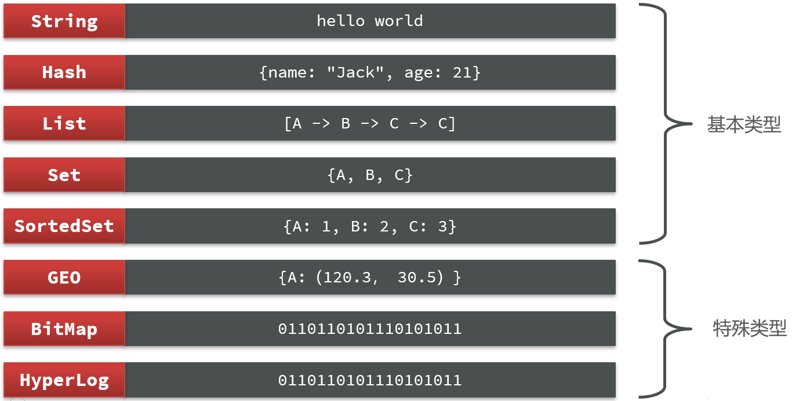

# Redis基础

##### 安装

1.上传到Linux，并解压拆包

```
tar -zxvf redis-6.2.13.tar.gz -C /usr/local
```

2.安装redis依赖的c相关环境

```
yum install gcc-c++
```

3.进入/usr/local/redis-6.2.13,对c的源码进行编译,命令：`  make ` 
4.进入redis的src目录，进行安装，命令`make install`
5.修改redis配置文件 （在底线模式中用/  查找）

```
vim redis.conf
```

```
#修改为默认后台运行 no --> yes
daemonize yes
#设置为需要密码（取消conf文件中的注释即可）（后面跟的就是密码）
requirepass 1qaz_123456
#让redis能够远程链接(默认本地) --> (任意地址)
#修改 bind 127.0.0.1  -->  #bind 127.0.0.1
```

6.新建系统服务文件(使可使用systemctl相关命令)

```
vim /etc/systemd/system/redis.service
```

```
#写入如下内容
[Unit]
Description=redis-server
After=network.target

[Service]
Type=forking
ExecStart=/usr/local/bin/redis-server /usr/local/redis-6.2.13/redis.conf
PrivateTmp=true

[Install]
WantedBy=multi-user.target
```

7.重载系统

```
重载系统
systemctl daemon-reload
```

```
##相关命令如下
# 启动
systemctl start redis
# 停止
systemctl stop redis
# 重启
systemctl restart redis
# 查看状态
systemctl status redis
#开机自启
systemctl enable redis
```

### Linux基础命令

#### 命令行客户端

```
redis-cli [options] [commonds]
	其中常见的options有：
	• -h 127.0.0.1：指定要连接的redis节点的IP地址，默认是127.0.0.1
	• -p 6379：指定要连接的redis节点的端口，默认是6379
	• -a 123321：指定redis的访问密码 
	其中的commonds就是Redis的操作命令，例如：
ping：与redis服务端做心跳测试，服务端正常会返回pong
```

#### redis通用命令

- KEYS查看所有符合模板的key，不建议在生产环境使用DEL 删除指定的key
- EXISTS判断是否存在
- EXPIRE给key设置一个有效期，到期自动删除(如验证码)TTL查看有效期即剩余时间，-1为永久，-2为已经删除

#### String常用命令

- SET:添加或者修改已经存在的一个String类型的键值对GET:根据key获取String类型的value
- MSET:批量添加多个String类型的键值对
- MGET:根据多个key获取多个String类型的valueINCR:让一个整型的key自增1
- INCRBY:让一个整型的key自增并指定步长，例如: incrby num 2让num值自增2
- INCRBYFLOAT:让一个浮点类型的数字自增并指定步长
- SETNX:添加一个String类型的键值对，前提是这个key不存在，否则不执行
- SETEX:添加一个String类型的键值对，并且指定有效期
- DECR:让一个整型的key自减1

#### Hash的常见命令

> **HSET key field value**					添加或者修改hash类型key的field的值
> HGET key field							  获取一个hash类型key的field的值
> HMSET										   批量添加多个hash类型key的field的值(与HSET合并了)

- HMGET:批量获取多个hash类型key的field的值
- HGETALL:获取一个hash类型的key中的所有的field和value
- HKEYS:获取一个hash类型的key中的所有的field
- HVALS:获取一个hash类型的key中的所有的value
- HINCRBY:让一个hash类型key的字段值自增并指定步长
- HSETNX:添加一个hash类型的key的field值，前提是这个field不存在，否则不执行

#### List常见命令

|      |      |
| ---- | -------------- |
| **LPUSH key value1 [value2]** | 向列表左侧插入一个或多个元素                  |
| **LPOP key**                      | 移除并返回列表左侧的第一个元素，没有则返回nil |
| **RPUSH key value1 [value2]**     | 向列表右侧插入一个或多个元素 |
| **RPOP key**                      | 移除并返回列表右侧的第一个元素          |
| **LRANGE key star end**           | 返回一段角标范围内的所有元素            |
| **BLPOP和BRPOP:与LPOP和RPOP类似** | 没有元素时等待指定时间，而不是直接返回nil     |

#### Set常见命令
- SADD key member :	向set中添加一个或多个元素
- SREM key member ...:移除set中的指定元素
- SCARD key:返回set中元素的个数
- SISMEMBER key member:判断一个元素是否存在于set中
- SMEMBERS:获取set中的所有元素
多集合操作
- SINTER key1 key2 ...求key1 与key2的交集
- SDIFF key1 key2 ...:求key1与key2的差集
- SUNION key1 key2 ..:求key1和key2的并集

#### SortedSet常见命令

- ZADD key score member:添加一个或多个元素到sorted set，如果已经存在则更新其score值
- ZREM key member:删除sorted set中的一个指定元素
- ZSCORE key member:获取sorted set中的指定元素的score值
- ZRANK key member:获取sorted set中的指定元素的排名ZCARD key:获取sorted set中的元素个数
- ZCOUNT key min max:统计score值在给定范围内的所有元素的个数
- ZINCRBY key increment member:让sorted set中的指定元素自增，步长为指定的increment值
- ZRANGE key min max:按照score排序后，获取指定排名范围内的元素
- ZRANGEBYSCORE key min max:按照score排序后，获取指定score范围内的元素
- ZDIFF、ZINTER、ZUNION:求差集、交集、并集
	所有排名默认都是升序，如果需要降序，则在命令的Z后面添加REV即可，如ZREVRANGE

#### 数据结构




### 可能会遇到的问题

##### 远程连接失败

```
#可能原因
1.防火墙没有暴露6379端口
firewall-cmd --zone=public --add-port=6379/tcp --permanent 	开放指定端口
firewall-cmd --reload										立即生效
firewall-cmd --zone=public --list-ports						查看开放的端口
2.腾讯云为开放6379/tcp端口
```

