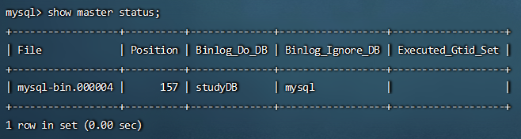

# MySql


### MySQL主从复制

MySQL主从复制是一个异步的复制过程，底层是基于Nysql数据库自带的二进制日志功能。就是一台或多台NysQL数据库(slave，即从库）从另一台MySQL数据库（master，即主库）进行日志的复制然后再解析日志并应用到自身，最终实现从库的数据和主库的数据保持一致。MySQL主从复制是MysQL数据库自带功能，无需借助第三方工具。

#### 主从复制的好处

- 提高数据库读写性能，提升系统吞吐量

> > 在业务复杂的系统中，如果有一条 SQL 语句的执行需要锁表，导致 MySQL 暂时不能提供读的服务，那么就很影响运行中的业务，使用主从复制，让主库负责写，从库负责读，这样即使主库出现了锁表的情景，通过读从库也可以保证业务的正常运作。

- 做数据库预热
- 架构扩展需要

> > 业务量越来越大，I/O 访问频率过高，单机无法满足，此时做多库的存储，降低磁盘I/O 访问的频率，提升整个数据库性能。


#### 主从复制原理

MySQL复制过程分成三步:
- master 服务器将数据的改变记录到二进制 binarylog 日志，当 master 上的数据发生改变时，则将其改变写入二进制日志中;
- slave将master的binary log拷贝到它的中继日志（relay log)
- 
  slave重做中继日志中的事件，将改变应用到自己的数据库中


#### 配置主从复制数据库

> 参考文献https://blog.csdn.net/u013068184/article/details/107691389
> 错误参考文献https://blog.csdn.net/weixin_45286211/article/details/117404539

##### 配置主库Master

1.修改MySQL数据库的配置文件`vim /etc/my.cnf`，然后重启`systemctl  restart mysqld`

```
###主从数据库配置核心部分
[mysqld]
# 设置同步的binary log二进制日志文件名前缀，默认为binlog；在MySQL 8.0中，无论是否指定--log bin选项，默认情况下都会启用二进制日志记录，并将log_bin系统变量设置为ON。
log-bin=mysql-bin
# 服务器唯一id，默认为1，值范围为1～2^32−1. ；主数据库和从数据库的server-id不能重复
server-id=1          

###可选配置
# 需要主从复制的数据库，如多个则重复配置
binlog-do-db=studyDB
# 复制过滤：也就是指定哪个数据库不用同步（mysql库一般不同步），如多个则重复配置
binlog-ignore-db=mysql
# 为每个session分配的内存，在事务过程中用来存储二进制日志的缓存
binlog_cache_size=1M
# 主从复制的格式（mixed,statement,row，默认格式是statement。建议是设置为row，主从复制时数据更加能够统一）
binlog_format=row
# 配置二进制日志自动删除/过期时间，单位秒，默认值为2592000，即30天；8.0.3版本之前使用expire_logs_days，单位天数，默认值为0，表示不自动删除。
binlog_expire_logs_seconds=2592000
# 跳过主从复制中遇到的所有错误或指定类型的错误，避免slave端复制中断，默认OFF关闭，可选值有OFF、all、ddl_exist_errors以及错误码列表。8.0.26版本之前使用slave_skip_errors
# 如：1062错误是指一些主键重复，1032错误是因为主从数据库数据不一致
replica_skip_errors=1062
```

2.登录MySQL数据库，创建用户，授权

- 登录数据库

```
mysql -uroot -p1qaz_123456
```
- 创建用户(删除用户drop user 'test1'@'localhost';)

> create user 'username'@'host' identified by 'password';
> 其中username为自定义的用户名；host为登录域名，host为'%'时表示为 任意IP，为localhost时表示本机，或者填写指定的IP地址；paasword为密码

```
create user 'slave'@'%' identified by '1Qaz_123456';
# 如果最后是connecting状态，使用如下的重建用户
# CREATE USER 'slave'@'%' IDENTIFIED WITH sha256_password BY '1Qaz_123456';
```

- 给用户授权

>  grant all privileges on *.* to 'username'@'%' with grant option; 
> 其中`*.*`第一个`*`表示所有数据库，第二个`*`表示所有数据表，如果不想授权全部那就把对应的`*`写成相应数据库或者数据表；`username`为指定的用户；`%`为该用户登录的域名

```
#grant all privileges on *.* to 'slave'@'%' with grant option; 
GRANT REPLICATION SLAVE ON *.* TO 'slave'@'%'; #授予从库复制的权限
FLUSH PRIVILEGES;		#刷新权限生效
```

- 为从库准备配置数据

```
show master status;
```



##### 配置从库slave

- 修改MySQL数据库的配置文件 vim /etc/my.cnf

```
###主从数据库配置核心部分
[mysqld]
# 设置同步的binary log二进制日志文件名前缀，默认是binlog
log-bin=mysql-bin
# 服务器唯一id，默认为1，值范围为1～2^32−1. ；主数据库和从数据库的server-id不能重复
server-id=101

###可选配置
# 需要主从复制的数据库 ，如多个则重复配置
replicate-do-db=studyDB
# 复制过滤：也就是指定哪个数据库不用同步（mysql库一般不同步） ，如多个则重复配置
binlog-ignore-db=mysql
# 为每个session分配的内存，在事务过程中用来存储二进制日志的缓存 
binlog_cache_size=1M
# 主从复制的格式（mixed,statement,row，默认格式是statement。建议是设置为row，主从复制时数据更加能够统一） 
binlog_format=row
# 配置二进制日志自动删除/过期时间，单位秒，默认值为2592000，即30天；8.0.3版本之前使用expire_logs_days，单位天数，默认值为0，表示不自动删除。
binlog_expire_logs_seconds=2592000
# 跳过主从复制中遇到的所有错误或指定类型的错误，避免slave端复制中断，默认OFF关闭，可选值有OFF、all、ddl_exist_errors以及错误码列表。8.0.26版本之前使用slave_skip_errors
# 如：1062错误是指一些主键重复，1032错误是因为主从数据库数据不一致
replica_skip_errors=1062
# relay_log配置中继日志，默认采用 主机名-relay-bin 的方式保存日志文件 
relay_log=replicas-mysql-relay-bin  
# log_replica_updates表示slave是否将复制事件写进自己的二进制日志，默认值ON开启；8.0.26版本之前使用log_slave_updates
log_replica_updates=ON
# 防止改变数据(只读操作，除了特殊的线程)
read_only=ON
```

- 重启MySQL服务

```
systemctl restart mysqld
```

- 登录MySQL（`mysql -uroot -p1qaz_123456`），执行如下sql，配置为从库

```
CHANGE REPLICATION SOURCE TO SOURCE_HOST='159.75.180.171',SOURCE_PORT=3306,SOURCE_USER='slave',SOURCE_PASSWORD='1qaz_123456',SOURCE_AUTO_POSITION=1;
```

- 启动slave线程

```
#出现该错误Replica failed to initialize applier metadata structure from the repository，表示又之前的记录
#reset slave;
START REPLICA;
```

- 查看从数据库的状态(粘贴到txt文件里看)

```
#低于8.0.22之执行
#show slave status;
#8.0.22后执行
SHOW REPLICA STATUS;
```


- 停止主从复制

```
#低于8.0.22版本的语法：
STOP SLAVE;
#自8.0.22版本后的语法：
STOP REPLICA;
```


### Linux安装MySQL

1. 检测当前系统中是否安装MySQL

```
rpm -qa					查询当前系统中安装的所有软件
rpm -qa | grep mysql	查询当前系统中安装的名称带mysql的软件
rpm -qa | grep mariadb	查询当前系统中安装的名称带mariadb的软件	（mariadb与MySQL冲突）
```

2. 卸载已经安装的冲突软件

```
rpm -e --nodeps 软件名称	卸载软件
rpm -e --nodeps mariadb-libs-5.5.68-1.el7.x86_64
```

3. 下载MySQL文件(mysql-8.0.34-1.el7.x86_64.rpm-bundle.tar)，上传至Linux

```
将文件下载至/usr/local/mysql
从包中解开
tar -xvf
```

4. 按照顺序安装rpm软件包

```
rpm -ivh mysql-community-common-8.0.34-1.el7.x86_64.rpm
rpm -ivh mysql-community-client-plugins-8.0.34-1.el7.x86_64.rpm
rpm -ivh mysql-community-libs-8.0.34-1.el7.x86_64.rpm
rpm -ivh mysql-community-devel-8.0.34-1.el7.x86_64.rpm
rpm -ivh mysql-community-libs-compat-8.0.34-1.el7.x86_64.rpm
rpm -ivh mysql-community-client-8.0.34-1.el7.x86_64.rpm
yum install net-tools
rpm -ivh mysql-community-server-8.0.34-1.el7.x86_64.rpm
rpm -ivh mysql-community-icu-data-files-8.0.34-1.el7.x86_64.rpm
rpm -ivh mysql-community-debuginfo-8.0.34-1.el7.x86_64.rpm
rpm -ivh mysql-community-embedded-compat-8.0.34-1.el7.x86_64.rpm
rpm -ivh mysql-community-server-debug-8.0.34-1.el7.x86_64.rpm
yum install perl-JSON
yum install perl-Test-Simple
rpm -ivh mysql-community-test-8.0.34-1.el7.x86_64.rpm
```

5. 启动MySQL

```
systemctl status mysqld		查看MySQL服务状态
systemctl start mysqld		启动MySQL服务
systemctl enable mysqld		开机启动MySQL服务
```

```
netstat -tunlp				查看已经启动的服务
netstat -tunlp	| grep mysqld

ps -ef | grep mysqld		查看MySQL进程
```

6. 登录MySQL，查阅临时密码

```
cat /var/log/mysqld.log						查看文件内容
cat /var/log/mysqld.log | grep password		查看包含password的文件内容行信息
```

7. 登录MySQL，修改密码，开放访问权限

```
mysql -uroot -p								登录MySQL（使用临时密码）
#修改密码
set password = '1Qaz_123456';			设置密码为1qaz_123456
（先修改密码后才能设置长度和安全等级）
set global validate_password.length = 4;		设置密码最低位数
set global validate_password.policy = LOW;	设置密码安全等级低，便于密码可以修改成简单密码

#开启访问权限
mysql5.0:
	grant all on*.*to'root'@'%'identified by '1qaz_12346';
mysql8.0:
	CREATE USER 'root'@'%' IDENTIFIED BY '1qaz_123456';  
	grant all privileges on *.* to 'root'@'%' ;
flush privileges;
```

8. 测试MySQL是否正常工作

```
show databases;
```

9. 远程连接

```
1.开启腾讯远程端口
2.本地使用navicat链接
```
