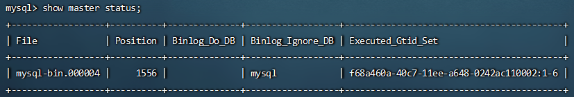
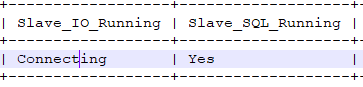
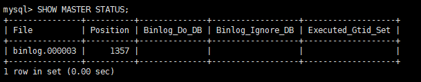
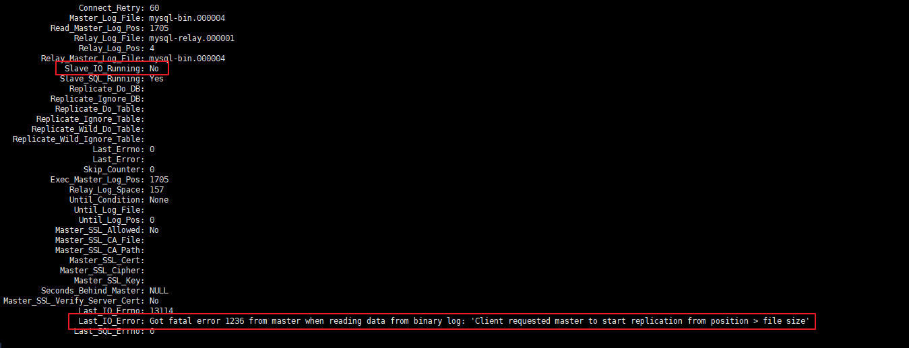

# MySql


### MySQL客户端语法

|                       | 语法                                                         | 说明                   |
| --------------------- | ------------------------------------------------------------ | ---------------------- |
| 1.登录和登出数据库    | mysql -u用户名 -p密码                                        |                        |
|                       | quit 或 exit 或 ctrl + d                                     |                        |
| 2.数据库操作的SQL语句 | show databases;                                              | 查看数据库             |
|                       | create database 数据库名 charset=utf8; <br />例： create database python charset=utf8; | 创建数据库             |
|                       | use 数据库名;                                                | 使用数据库             |
|                       | select database();                                           | 查看当前使用的数据库   |
|                       | drop database 数据库名; <br />例： drop database python;     | 删除数据库-慎重        |
| 3.表结构操作的SQL语句 | show tables;                                                 | 查看当前数据库中所有表 |
|                       | create table students(<br/> id int unsigned primary key auto_increment not null,<br/> name varchar(20) not null,<br/> age tinyint unsigned default 0,<br/> height decimal(5,2),<br/> gender enum('男','女','人妖','保密')<br/>); | 创建表                 |
| 4.用户权限            | create user 'username'@'host' identified by 'password';<br/>其中username为自定义的用户名；<br />host为登录域名，host为'%'时表示为 任意IP，为localhost时表示本机，或者填写指定的IP地址；paasword为密码 | 创建用户               |
|                       | grant all privileges on *.* to 'username'@'%' with grant option; <br />其中`*.*`第一个`*`表示所有数据库，第二个`*`表示所有数据表，如果不想授权全部那就把对应的`*`写成相应数据库或者数据表；`username`为指定的用户；`%`为该用户登录的域名 | 用户授权               |


```
GRANT ALL PRIVILEGES ON *.* TO 'root'@'%' IDENTIFIED BY '1Qaz_123456' WITH GRANT OPTION;
```


### MySQL主从复制

MySQL主从复制是一个异步的复制过程，底层是基于Nysql数据库自带的二进制日志功能。就是一台或多台NysQL数据库(slave，即从库）从另一台MySQL数据库（master，即主库）进行日志的复制然后再解析日志并应用到自身，最终实现从库的数据和主库的数据保持一致。MySQL主从复制是MysQL数据库自带功能，无需借助第三方工具。

#### 主从复制的好处

- 提高数据库读写性能，提升系统吞吐量

> > 在业务复杂的系统中，如果有一条 SQL 语句的执行需要锁表，导致 MySQL 暂时不能提供读的服务，那么就很影响运行中的业务，使用主从复制，让主库负责写，从库负责读，这样即使主库出现了锁表的情景，通过读从库也可以保证业务的正常运作。

- 做数据库预热
- 架构扩展需要

> > 业务量越来越大，I/O 访问频率过高，单机无法满足，此时做多库的存储，降低磁盘I/O 访问的频率，提升整个数据库性能。


#### 主从复制原理

MySQL复制过程分成三步:
- master 服务器将数据的改变记录到二进制 binarylog 日志，当 master 上的数据发生改变时，则将其改变写入二进制日志中;
- slave将master的binary log拷贝到它的中继日志（relay log)
- 
  slave重做中继日志中的事件，将改变应用到自己的数据库中


#### 配置主从复制数据库1

> 参考文献https://blog.csdn.net/u013068184/article/details/107691389
> 错误参考文献https://blog.csdn.net/weixin_45286211/article/details/117404539

##### 配置主库Master

1.修改MySQL数据库的配置文件`vim /etc/my.cnf`，然后重启`systemctl  restart mysqld`

```
###主从数据库配置核心部分
[mysqld]
# 设置同步的binary log二进制日志文件名前缀，默认为binlog；在MySQL 8.0中，无论是否指定--log bin选项，默认情况下都会启用二进制日志记录，并将log_bin系统变量设置为ON。
log-bin=mysql-bin
# 服务器唯一id，默认为1，值范围为1～2^32−1. ；主数据库和从数据库的server-id不能重复
server-id=100          

###可选配置
# 需要主从复制的数据库，如多个则重复配置
binlog-do-db=studyDB
# 复制过滤：也就是指定哪个数据库不用同步（mysql库一般不同步），如多个则重复配置
binlog-ignore-db=mysql
# 为每个session分配的内存，在事务过程中用来存储二进制日志的缓存
binlog_cache_size=1M
# 主从复制的格式（mixed,statement,row，默认格式是statement。建议是设置为row，主从复制时数据更加能够统一）
binlog_format=row
# 配置二进制日志自动删除/过期时间，单位秒，默认值为2592000，即30天；8.0.3版本之前使用expire_logs_days，单位天数，默认值为0，表示不自动删除。
binlog_expire_logs_seconds=2592000
# 跳过主从复制中遇到的所有错误或指定类型的错误，避免slave端复制中断，默认OFF关闭，可选值有OFF、all、ddl_exist_errors以及错误码列表。8.0.26版本之前使用slave_skip_errors
# 如：1062错误是指一些主键重复，1032错误是因为主从数据库数据不一致
replica_skip_errors=1062
```

2.登录MySQL数据库，创建用户，授权

- 登录数据库

```
mysql -uroot -p1qaz_123456
```
- 创建用户(删除用户drop user 'test1'@'localhost';)

> create user 'username'@'host' identified by 'password';
> 其中username为自定义的用户名；host为登录域名，host为'%'时表示为 任意IP，为localhost时表示本机，或者填写指定的IP地址；paasword为密码

```
# 使用第二种是connecting状态，就使用第一种重建用户
CREATE USER 'slave'@'%' IDENTIFIED WITH sha256_password BY '1Qaz_123456';
#create user 'slave'@'%' identified by '1Qaz_123456';

```

- 给用户授权

>  grant all privileges on *.* to 'username'@'%' with grant option; 
> 其中`*.*`第一个`*`表示所有数据库，第二个`*`表示所有数据表，如果不想授权全部那就把对应的`*`写成相应数据库或者数据表；`username`为指定的用户；`%`为该用户登录的域名

```
#grant all privileges on *.* to 'slave'@'%' with grant option; 
GRANT REPLICATION SLAVE ON *.* TO 'slave'@'%'; #授予从库复制的权限
FLUSH PRIVILEGES;		#刷新权限生效
```

- 为从库准备配置数据

```
show master status;
```



##### 配置从库slave

- 修改MySQL数据库的配置文件 vim /etc/my.cnf

```
###主从数据库配置核心部分
[mysqld]
# 设置同步的binary log二进制日志文件名前缀，默认是binlog
log-bin=mysql-bin
# 服务器唯一id，默认为1，值范围为1～2^32−1. ；主数据库和从数据库的server-id不能重复
server-id=2

#开启 GTID
gtid_mode=ON
enforce_gtid_consistency=ON

###可选配置
# 需要主从复制的数据库 ，如多个则重复配置
replicate-do-db=test
# 复制过滤：也就是指定哪个数据库不用同步（mysql库一般不同步） ，如多个则重复配置
binlog-ignore-db=mysql
# 为每个session分配的内存，在事务过程中用来存储二进制日志的缓存 
binlog_cache_size=1M
# 主从复制的格式（mixed,statement,row，默认格式是statement。建议是设置为row，主从复制时数据更加能够统一） 
binlog_format=row
# 配置二进制日志自动删除/过期时间，单位秒，默认值为2592000，即30天；8.0.3版本之前使用expire_logs_days，单位天数，默认值为0，表示不自动删除。
binlog_expire_logs_seconds=2592000
# 跳过主从复制中遇到的所有错误或指定类型的错误，避免slave端复制中断，默认OFF关闭，可选值有OFF、all、ddl_exist_errors以及错误码列表。8.0.26版本之前使用slave_skip_errors
# 如：1062错误是指一些主键重复，1032错误是因为主从数据库数据不一致
replica_skip_errors=1062
# relay_log配置中继日志，默认采用 主机名-relay-bin 的方式保存日志文件 
relay_log=replicas-mysql-relay-bin
# log_replica_updates表示slave是否将复制事件写进自己的二进制日志，默认值ON开启；8.0.26版本之前使用log_slave_updates
log_replica_updates=ON
# 防止改变数据(只读操作，除了特殊的线程)
read_only=ON
```

- 重启MySQL服务

```
systemctl restart mysqld
```

- 登录MySQL（`mysql -uroot -p1Qaz_123456`），执行如下sql，配置为从库

```
##选择对应的
#基于全局事务标识符（GTID）的方法
CHANGE REPLICATION SOURCE TO SOURCE_HOST='159.75.180.171',SOURCE_PORT=3306,SOURCE_USER='slave',SOURCE_PASSWORD='1Qaz_123456',SOURCE_AUTO_POSITION=1;

#基于二进制日志文件的方法
#CHANGE REPLICATION SOURCE TO SOURCE_HOST='159.75.180.171',SOURCE_PORT=3310,SOURCE_USER='slave',SOURCE_PASSWORD='1Qaz_123456',SOURCE_LOG_FILE='mysql-bin.000002',SOURCE_LOG_POS=545;

```

- 启动slave线程

```
#出现该错误Replica failed to initialize applier metadata structure from the repository，表示又之前的记录
#reset slave;
START REPLICA;
```

- 查看从数据库的状态(粘贴到txt文件里看)

```
#低于8.0.22之执行
#show slave status;
#8.0.22后执行
SHOW REPLICA STATUS;
```



- 停止主从复制

```
#低于8.0.22版本的语法：
STOP SLAVE;
#自8.0.22版本后的语法：
STOP REPLICA;
```

#### 尚硅谷配置主从数据库2

##### 2.1、准备主服务器

- **step1：在docker中创建并启动MySQL主服务器：**`端口3306`

```shell
docker run -d \
-p 3311:3306 \
--restart=always \
-v /docker/mysql/3311/conf:/etc/mysql/conf.d \
-v /docker/mysql/3311/data:/var/lib/mysql \
-e MYSQL_ROOT_PASSWORD=1Qaz_123456 \
--name mysql-master \
mysql:8.0.29
```


- **step2：创建MySQL主服务器配置文件：** 

默认情况下MySQL的binlog日志是自动开启的，可以通过如下配置定义一些可选配置

```shell
vim /docker/mysql/3311/conf/my.cnf
```

配置如下内容

```properties
[mysqld]
# 服务器唯一id，默认值1
server-id=1
# 设置日志格式，默认值ROW
binlog_format=STATEMENT
# 二进制日志名，默认binlog
# log-bin=binlog
# 设置需要复制的数据库，默认复制全部数据库
#binlog-do-db=mytestdb
# 设置不需要复制的数据库
#binlog-ignore-db=mysql
#binlog-ignore-db=infomation_schema
```

重启MySQL容器

```shell
docker restart atguigu-mysql-master
```


`binlog格式说明：`

- binlog_format=STATEMENT：日志记录的是主机数据库的`写指令`，性能高，但是now()之类的函数以及获取系统参数的操作会出现主从数据不同步的问题。
- binlog_format=ROW（默认）：日志记录的是主机数据库的`写后的数据`，批量操作时性能较差，解决now()或者  user()或者  @@hostname 等操作在主从机器上不一致的问题。
- binlog_format=MIXED：是以上两种level的混合使用，有函数用ROW，没函数用STATEMENT，但是无法识别系统变量


`binlog-ignore-db和binlog-do-db的优先级问题：`


- **step3：使用命令行登录MySQL主服务器：**

```shell
#进入容器：env LANG=C.UTF-8 避免容器中显示中文乱码
docker exec -it mysql-master env LANG=C.UTF-8 /bin/bash
#进入容器内的mysql命令行
mysql -uroot -p1Qaz_123456
#修改默认密码校验方式（遇到错误号码2058，原因mysql8的密码安全策略更严格了）
ALTER USER 'root'@'%' IDENTIFIED WITH mysql_native_password BY '1Qaz_123456';
```


- **step4：主机中创建slave用户：**

```sql
-- 创建slave用户
CREATE USER 'slave'@'%';
-- 设置密码
ALTER USER 'slave'@'%' IDENTIFIED WITH mysql_native_password BY '1Qaz_123456';
-- 授予复制权限
GRANT REPLICATION SLAVE ON *.* TO 'slave'@'%';
-- 刷新权限
FLUSH PRIVILEGES;
```


- **step5：主机中查询master状态：**

执行完此步骤后`不要再操作主服务器MYSQL`，防止主服务器状态值变化

```sql
SHOW MASTER STATUS;
```

记下`File`和`Position`的值。执行完此步骤后不要再操作主服务器MYSQL，防止主服务器状态值变化。




##### 2.2、准备从服务器

可以配置多台从机slave1、slave2...，这里以配置slave1为例

- **step1：在docker中创建并启动MySQL从服务器：**`端口3307`

```shell
docker run -d \
-p 3312:3306 \
--restart=always \
-v /docker/mysql/3312/conf:/etc/mysql/conf.d \
-v /docker/mysql/3312/data:/var/lib/mysql \
-e MYSQL_ROOT_PASSWORD=1Qaz_123456 \
--name mysql-slave1 \
mysql:8.0.29

------------------
docker run -d \
-p 3313:3306 \
--restart=always \
-v /docker/mysql/3313/conf:/etc/mysql/conf.d \
-v /docker/mysql/3313/data:/var/lib/mysql \
-e MYSQL_ROOT_PASSWORD=1Qaz_123456 \
--name mysql-slave2 \
mysql:8.0.29

vim /docker/mysql/3313/conf/my.cnf

[mysqld]
# 服务器唯一id，每台服务器的id必须不同，如果配置其他从机，注意修改id
server-id=3
# 中继日志名，默认xxxxxxxxxxxx-relay-bin
#relay-log=relay-bin

docker restart mysql-slave2

docker exec -it mysql-slave2 env LANG=C.UTF-8 /bin/bash
mysql -uroot -p1Qaz_123456

CHANGE MASTER TO MASTER_HOST='121.43.121.124', 
MASTER_USER='slave',MASTER_PASSWORD='1Qaz_123456', MASTER_PORT=3311,
MASTER_LOG_FILE='binlog.000008',MASTER_LOG_POS=157; 

START SLAVE;
-- 查看状态（不需要分号）
SHOW SLAVE STATUS\G
```


- **step2：创建MySQL从服务器配置文件：** 

```shell
vim /docker/mysql/3312/conf/my.cnf
```

配置如下内容：

```properties
[mysqld]
# 服务器唯一id，每台服务器的id必须不同，如果配置其他从机，注意修改id
server-id=2
# 中继日志名，默认xxxxxxxxxxxx-relay-bin
#relay-log=relay-bin
```

重启MySQL容器

```shell
docker restart mysql-slave1
```


- **step3：使用命令行登录MySQL从服务器：**

```shell
#进入容器：
docker exec -it mysql-slave1 env LANG=C.UTF-8 /bin/bash
#进入容器内的mysql命令行
mysql -uroot -p1Qaz_123456
#修改默认密码校验方式
ALTER USER 'root'@'%' IDENTIFIED WITH mysql_native_password BY '1Qaz_123456';
```


- **step4：在从机上配置主从关系：**

在**从机**上执行以下SQL操作

```sql
CHANGE MASTER TO MASTER_HOST='121.43.121.124', 
MASTER_USER='slave',MASTER_PASSWORD='1Qaz_123456', MASTER_PORT=3311,
MASTER_LOG_FILE='binlog.000006',MASTER_LOG_POS=157; 
```


##### 2.3、启动主从同步

启动从机的复制功能，执行SQL：

```sql
START SLAVE;
-- 查看状态（不需要分号）
SHOW SLAVE STATUS\G
```


**两个关键进程：**下面两个参数都是Yes，则说明主从配置成功！


##### 2.4、实现主从同步

在主机中执行以下SQL，在从机中查看数据库、表和数据是否已经被同步

```sql
CREATE DATABASE db_user;
USE db_user;
CREATE TABLE t_user (
 id BIGINT AUTO_INCREMENT,
 uname VARCHAR(30),
 PRIMARY KEY (id)
);
INSERT INTO t_user(uname) VALUES('zhang3');
INSERT INTO t_user(uname) VALUES(@@hostname);
```


##### 2.5、停止和重置

需要的时候，可以使用如下SQL语句

```sql
-- 在从机上执行。功能说明：停止I/O 线程和SQL线程的操作。
stop slave; 

-- 在从机上执行。功能说明：用于删除SLAVE数据库的relaylog日志文件，并重新启用新的relaylog文件。
reset slave;

-- 在主机上执行。功能说明：删除所有的binglog日志文件，并将日志索引文件清空，重新开始所有新的日志文件。
-- 用于第一次进行搭建主从库时，进行主库binlog初始化工作；
reset master;
```


##### **2.6、常见问题**

###### 问题1

启动主从同步后，常见错误是`Slave_IO_Running： No 或者 Connecting` 的情况，此时查看下方的 `Last_IO_ERROR`错误日志，根据日志中显示的错误信息在网上搜索解决方案即可




**典型的错误例如：**`Last_IO_Error: Got fatal error 1236 from master when reading data from binary log: 'Client requested master to start replication from position > file size'`

**解决方案：**

```sql
-- 在从机停止slave
SLAVE STOP;

-- 在主机查看mater状态
SHOW MASTER STATUS;
-- 在主机刷新日志
FLUSH LOGS;
-- 再次在主机查看mater状态（会发现File和Position发生了变化）
SHOW MASTER STATUS;
-- 修改从机连接主机的SQL，并重新连接即可
```


###### 问题2

启动docker容器后提示 `WARNING: IPv4 forwarding is disabled. Networking will not work.`


此错误，虽然不影响主从同步的搭建，但是如果想从远程客户端通过以下方式连接docker中的MySQL则没法连接

```shell
C:\Users\administrator>mysql -h 192.168.100.201 -P 3306 -u root -p
```

**解决方案：**

```shell
#修改配置文件：
vim /usr/lib/sysctl.d/00-system.conf
#追加
net.ipv4.ip_forward=1
#接着重启网络
systemctl restart network
```


### 权限操作

- 创建用户

```
create user 'test1'@'localhost' identified by '密码';
create user 'test2'@'%' identified with mysql_native_password BY '密码';
```

- 修改密码

```
Alter user 'test1'@'localhost' identified by '新密码';
flush privileges;
```

- 授权

```
grant all privileges on *.* to 'test1'@'localhost' with grant option;
#all privileges 可换成select,update,insert,delete,drop,create等操作 如：grant select,insert,update,delete on . to 'test1'@'localhost';
```

- 刷新权限

```
flush privileges;
```

- 查看用户授权信息

```ada
show grants for 'test1'@'localhost;
```

- 撤销权限

```pgsql
revoke all privileges on *.* from 'test1'@'localhost';
#用户有什么权限就撤什么权限
```

- 删除用户

```n1ql
drop user 'test1'@'localhost';
```

### Linux安装MySQL

1. 检测当前系统中是否安装MySQL

```
rpm -qa					查询当前系统中安装的所有软件
rpm -qa | grep mysql	查询当前系统中安装的名称带mysql的软件
rpm -qa | grep mariadb	查询当前系统中安装的名称带mariadb的软件	（mariadb与MySQL冲突）
```

2. 卸载已经安装的冲突软件

```
rpm -e --nodeps 软件名称	卸载软件
rpm -e --nodeps mariadb-libs-5.5.68-1.el7.x86_64
```

3. 下载MySQL文件(mysql-8.0.34-1.el7.x86_64.rpm-bundle.tar)，上传至Linux

```
将文件下载至/usr/local/mysql
从包中解开
tar -xvf
```

4. 按照顺序安装rpm软件包

```
rpm -ivh mysql-community-common-8.0.34-1.el7.x86_64.rpm
rpm -ivh mysql-community-client-plugins-8.0.34-1.el7.x86_64.rpm
rpm -ivh mysql-community-libs-8.0.34-1.el7.x86_64.rpm
rpm -ivh mysql-community-devel-8.0.34-1.el7.x86_64.rpm
rpm -ivh mysql-community-libs-compat-8.0.34-1.el7.x86_64.rpm
rpm -ivh mysql-community-client-8.0.34-1.el7.x86_64.rpm
yum install net-tools
rpm -ivh mysql-community-server-8.0.34-1.el7.x86_64.rpm
rpm -ivh mysql-community-icu-data-files-8.0.34-1.el7.x86_64.rpm
rpm -ivh mysql-community-debuginfo-8.0.34-1.el7.x86_64.rpm
rpm -ivh mysql-community-embedded-compat-8.0.34-1.el7.x86_64.rpm
rpm -ivh mysql-community-server-debug-8.0.34-1.el7.x86_64.rpm
yum install perl-JSON
yum install perl-Test-Simple
rpm -ivh mysql-community-test-8.0.34-1.el7.x86_64.rpm
```

5. 启动MySQL

```
systemctl status mysqld		查看MySQL服务状态
systemctl start mysqld		启动MySQL服务
systemctl enable mysqld		开机启动MySQL服务
```

```
netstat -tunlp				查看已经启动的服务
netstat -tunlp	| grep mysqld

ps -ef | grep mysqld		查看MySQL进程
```

6. 登录MySQL，查阅临时密码

```
cat /var/log/mysqld.log						查看文件内容
cat /var/log/mysqld.log | grep password		查看包含password的文件内容行信息
```

7. 登录MySQL，修改密码，开放访问权限

```
mysql -uroot -p								登录MySQL（使用临时密码）
#修改密码
set password = '1Qaz_123456';			设置密码为1qaz_123456
（先修改密码后才能设置长度和安全等级）
set global validate_password.length = 4;		设置密码最低位数
set global validate_password.policy = LOW;	设置密码安全等级低，便于密码可以修改成简单密码

#开启访问权限
mysql5.0:
	grant all on*.*to'root'@'%'identified by '1qaz_12346';
mysql8.0:
	CREATE USER 'root'@'%' IDENTIFIED BY '1qaz_123456';  
	grant all privileges on *.* to 'root'@'%' ;
flush privileges;
```

8. 测试MySQL是否正常工作

```
show databases;
```

9. 远程连接

```
1.开启腾讯远程端口
2.本地使用navicat链接
```
