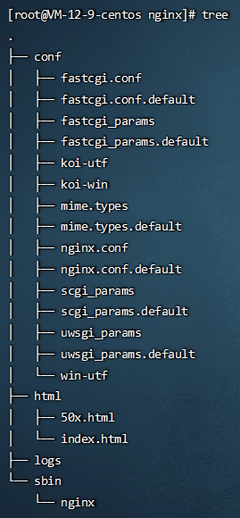

Nginx

#### 安装后目录结构



### 基础命令（进入sbin目录）

##### 当前版本

```
./nginx -v
```

##### 检查配置文件nginx.conf是否正确

```
./nginx -t
```

##### 启动

```
./nginx
```

##### 停止

```
./nginx -s stop
```

##### 查看nginx进程

```
ps -ef/grep nginx
```

##### 重启

```
./nginx -s reload
```

