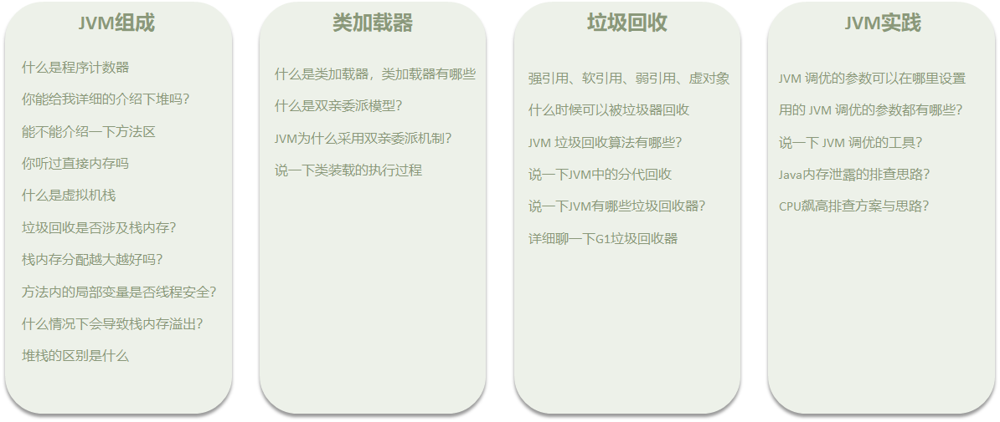
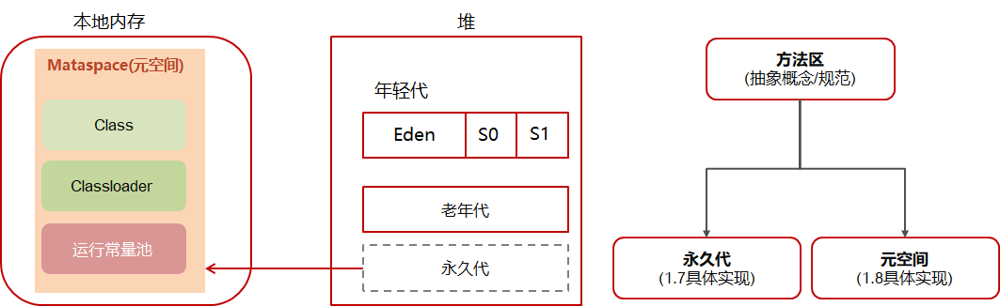

# Java基础

# I/O


# 集合


# 多线程-并发编程


### 线程基础知识


#### 线程包括哪些状态，状态之间是如何变化的

**线程状态**：新建（NEW）、可运行（RUNNABLE）、阻塞（BLOCKED）、等待（ WAITING ）、时间等待（TIMED_WALTING）、终止（TERMINATED）

**线程状态变化**

- 创建线程对象是新建状态

- 调用了start()方法转变为可执行状态

- 线程获取到了CPU的执行权，执行结束是终止状态

- 在可执行状态的过程中，如果没有获取CPU的执行权，可能会切换其他状态
  - 如果没有获取锁（synchronized或lock）进入阻塞状态，获得锁再切换为可执行状态
  - 如果线程调用了wait()方法进入等待状态，其他线程调用notify()唤醒后可切换为可执行状态
  - 如果线程调用了sleep(50)方法，进入计时等待状态，到时间后可切换为可执行状态


#### notify()和 notifyAll()有什么区别？

**notifyAll**：唤醒所有wait的线程
**notify**：只随机唤醒一个 wait 线程

#### 在java中wait和sleep方法的不同？

**共同点**
wait() ，wait(long) 和 sleep(long) 的效果都是让当前线程暂时放弃 CPU 的使用权，进入阻塞状态

**不同点**

1. 方法归属不同
   sleep(long) 是 Thread 的静态方法
   而 wait()，wait(long) 都是 Object 的成员方法，每个对象都有
2. 醒来时机不同
   执行 sleep(long) 和 wait(long) 的线程都会在等待相应毫秒后醒来
   wait(long) 和 wait() 还可以被 notify 唤醒，wait() 如果不唤醒就一直等下去
   它们都可以被打断唤醒
3. 锁特性不同（重点）
   wait 方法的调用必须先获取 wait 对象的锁，而 sleep 则无此限制
   wait 方法执行后会释放对象锁，允许其它线程获得该对象锁（我放弃 cpu，但你们还可以用）
   而 sleep 如果在 synchronized 代码块中执行，并不会释放对象锁（我放弃 cpu，你们也用不了）

#### 如何停止一个正在运行的线程？

- 使用退出标志，使线程正常退出，也就是当run方法完成后线程终止
- 使用stop方法强行终止（不推荐，方法已作废）
- 使用interrupt方法中断线程
  - 打断阻塞的线程（ sleep，wait，join ）的线程，线程会抛出InterruptedException异常
  - 打断正常的线程，可以根据打断状态来标记是否退出线程

### 线程中并发安全

#### 请谈谈你对 volatile 的理解

①保证线程间的可见性

用 volatile 修饰共享变量，能够防止编译器等优化发生，让一个线程对共享变量的修改对另一个线程可见

② 禁止进行指令重排序

指令重排：用 volatile 修饰共享变量会在读、写共享变量时加入不同的屏障，阻止其他读写操作越过屏障，从而达到阻止重排序的效果

#### synchronized关键字的底层原理

lSynchronized【对象锁】采用互斥的方式让同一时刻至多只有一个线程能持有【对象锁】
它的底层由monitor实现的，monitor是jvm级别的对象（ C++实现），线程获得锁需要使用对象（锁）关联monitor
在monitor内部有三个属性，分别是owner、entrylist、waitset
其中owner是关联的获得锁的线程，并且只能关联一个线程；entrylist关联的是处于阻塞状态的线程；waitset关联的是处于Waiting状态的线程


#### 你谈谈 JMM（Java内存模型）

- JMM(Java Memory Model)Java内存模型，定义了共享内存中多线程程序读写操作的行为规范，通过这些规则来规范对内存的读写操作从而保证指令的正确性

- JMM把内存分为两块，一块是私有线程的工作区域（工作内存），一块是所有线程的共享区域（主内存）

- 线程跟线程之间是相互隔离，线程跟线程交互需要通过主内存


#### 什么是CAS

- CAS的全称是： Compare And Swap(比较再交换);它体现的一种乐观锁的思想，在无锁状态下保证线程操作数据的原子性。

- CAS使用到的地方很多：AQS框架、AtomicXXX类

- 在操作共享变量的时候使用的自旋锁，效率上更高一些

- CAS的底层是调用的Unsafe类中的方法，都是操作系统提供的，其他语言实现

#### 乐观锁和悲观锁的区别

- CAS 是基于乐观锁的思想：最乐观的估计，不怕别的线程来修改共享变量，就算改了也没关系，我吃亏点再重试呗。
- synchronized 是基于悲观锁的思想：最悲观的估计，得防着其它线程来修改共享变量，我上了锁你们都别想改，我改完了解开锁，你们才有机会。

#### 谈谈对valatile的理解


#### 什么是AQS?

> 是多线程中的队列同步器。是一种锁机制，它是做为一个基础框架使用的，像ReentrantLock、Semaphore都是基于AQS实现的;
> AQS内部维护了一个先进先出的双向队列，队列中存储的排队的线程;
> 在AQS内部还有一个属性state，这个state就相当于是一个资源，默认是0（无锁状态），如果队列中的有一个线程修改成功了state为1，则当前线程就相等于获取了资源;
> 在对state修改的时候使用的cas操作，保证多个线程修改的情况下原子性.

全称是 AbstractQueuedSynchronizer，是阻塞式锁和相关的同步器工具的框架，它是构建锁或者其他同步组件的基础框架;

AQS常见的实现类有

- ReentrantLock      阻塞式锁
- Semaphore        信号量
- CountDownLatch   倒计时锁

##### **AQS的工作机制**

- 在AQS中维护了一个使用了volatile修饰的state属性来表示资源的状态，0表示无锁，1表示有锁
- 提供了基于 FIFO 的等待队列，类似于 Monitor 的 EntryList
- 条件变量来实现等待、唤醒机制，支持多个条件变量，类似于 Monitor 的 WaitSet


##### AQS多个线程共同去抢资源如何保证的原子性?

当多个线程共同抢锁使用CAS操作设置state状态

#### synchronized和Lock有什么区别 ?

**语法层面**

synchronized 是关键字，源码在 jvm 中，用 c++ 语言实现
Lock 是接口，源码由 jdk 提供，用 java 语言实现
使用 synchronized 时，退出同步代码块锁会自动释放，而使用 Lock 时，需要手动调用 unlock 方法释放锁

**功能层面**

二者均属于悲观锁、都具备基本的互斥、同步、锁重入功能
Lock 提供了许多 synchronized 不具备的功能，例如公平锁、可打断、可超时、多条件变量
Lock 有适合不同场景的实现，如 ReentrantLock， ReentrantReadWriteLock(读写锁)

**性能层面**

在没有竞争时，synchronized 做了很多优化，如偏向锁、轻量级锁，性能不赖
在竞争激烈时，Lock 的实现通常会提供更好的性能

#### ThreadLocal

### 线程池

#### 线程池的核心参数


**corePoolSize** 核心线程数目
**maximumPoolSize** 最大线程数目 = (核心线程+救急线程的最大数目)
**keepAliveTime** 生存时间 - 救急线程的生存时间，生存时间内没有新任务，此线程资源会释放
**unit** 时间单位 - 救急线程的生存时间单位，如秒、毫秒等
**workQueue** - 当没有空闲核心线程时，新来任务会加入到此队列排队，队列满会创建救急线程执行任务
**threadFactory** 线程工厂 - 可以定制线程对象的创建，例如设置线程名字、是否是守护线程等
**handler** 拒绝策略 - 当所有线程都在繁忙，workQueue 也放满时，会触发拒绝策略

#### 线程池的执行流程


**拒绝策略**

1.AbortPolicy：直接抛出异常，默认策略；
2.CallerRunsPolicy：用调用者所在的线程来执行任务；
3.DiscardOldestPolicy：丢弃阻塞队列中靠最前的任务，并执行当前任务；
4.DiscardPolicy：直接丢弃任务；

**常见的阻塞队列**

- 容量为 `Integer.MAX_VALUE` 的 `LinkedBlockingQueue`（无界队列）：`FixedThreadPool` 和 `SingleThreadExector` 。由于队列永远不会被放满，因此`FixedThreadPool`最多只能创建核心线程数的线程。

- `SynchronousQueue`（同步队列）：`CachedThreadPool` 。`SynchronousQueue` 没有容量，不存储元素，目的是保证对于提交的任务，如果有空闲线程，则使用空闲线程来处理；否则新建一个线程来处理任务。也就是说，`CachedThreadPool` 的最大线程数是 `Integer.MAX_VALUE` ，可以理解为线程数是可以无限扩展的，可能会创建大量线程，从而导致 OOM。

- `DelayedWorkQueue`（延迟阻塞队列）：`ScheduledThreadPool` 和 `SingleThreadScheduledExecutor` 。`DelayedWorkQueue` 的内部元素并不是按照放入的时间排序，而是会按照延迟的时间长短对任务进行排序，内部采用的是“堆”的数据结构，可以保证每次出队的任务都是当前队列中执行时间最靠前的。`DelayedWorkQueue` 添加元素满了之后会自动扩容原来容量的 1/2，即永远不会阻塞，最大扩容可达 `Integer.MAX_VALUE`，所以最多只能创建核心线程数的线程。

##### **ArrayBlockingQueue的LinkedBlockingQueue区别**

| **LinkedBlockingQueue**          | **ArrayBlockingQueue** |
| -------------------------------- | ---------------------- |
| 默认无界，支持有界               | 强制有界               |
| 底层是链表                       | 底层是数组             |
| 是懒惰的，创建节点的时候添加数据 | 提前初始化 Node  数组  |
| 入队会生成新 Node                | Node需要是提前创建好的 |
| **两把锁（头尾）**  性能更高     | **一把锁**             |


#### 如何确定线程核心数？

过多的线程数也会增加上下文切换的成本，所以需要选择合适的线程核心数；

**CPU 密集型任务(N+1)：** 这种任务消耗的主要是 CPU 资源，可以将线程数设置为 N（CPU 核心数）+1。比 CPU 核心数多出来的一个线程是为了防止线程偶发的缺页中断，或者其它原因导致的任务暂停而带来的影响。一旦任务暂停，CPU 就会处于空闲状态，而在这种情况下多出来的一个线程就可以充分利用 CPU 的空闲时间。

**I/O 密集型任务(2N)：** 这种任务应用起来，系统会用大部分的时间来处理 I/O 交互，而线程在处理 I/O 的时间段内不会占用 CPU 来处理，这时就可以将 CPU 交出给其它线程使用。因此在 I/O 密集型任务的应用中，我们可以多配置一些线程，具体的计算方法是 2N。

## 使用场景

#### 案例一（ES数据批量导入）

在我们项目上线之前，我们需要把数据库中的数据一次性的同步到es索引库中，但是当时的数据好像是1000万左右，一次性读取数据肯定不行（oom异常），当时我就想到可以使用线程池的方式导入，利用CountDownLatch来控制，就能避免一次性加载过多，防止内存溢出


# MySQL


### 如何定位慢查询

系统部署了运维的监控系统`Skywalking`,可以看见哪一个接口比较慢,可以看到SQL的具体执行时间,然后会在钉钉群里发送消息,告知开发

### SQL执行很慢,如何分析

1. 可以采用EXPLAIN 或者 DESC命令获取 MySQL 如何执行 SELECT 语句的信息,
2. 通过key和key_len字段检查是否命中了索引
3. 通过type字段查看是否有进一步优化的空间
4. 通过Extra建议判断是否出现了回表的情况,可以尝试添加索引字段,或者修改返回字段来修复(Using index condition 表示出现了回表查询)


type 这条sql的连接的类型，性能由好到差为NULL、system、const、eq_ref、ref、range、 index、all 
system：查询系统中的表
const：根据主键查询
eq_ref：主键索引查询或唯一索引查询
ref：索引查询
range：范围查询
index：索引树扫描(会遍历整个索引树去查询)
all：全盘扫描


### 索引

#### 存储引擎

**存储引擎**就是存储数据、建立索引、更新/查询数据等技术的实现方式 。存储引擎是基于表的，而不是基于库的，所以存储引擎也可被称为表类型。


#### 索引底层数据结构

> 索引（index）是帮助MySQL高效获取数据的数据结构(有序)。在数据之外，数据库系统还维护着满足特定查找算法的数据结构（B+树），这些数据结构以某种方式引用（指向）数据， 这样就可以在这些数据结构上实现高级查找算法，这种数据结构就是索引。

B+树的特点

- 阶数更多,路径更短,也即是矮胖树
- 磁盘读写代价B+树更低,非叶子节点只存储键与子节点指针,叶子节点存储键和数据
- B+树便于扫库和区间查询,叶子节点是一个双向链表


#### 聚簇索引和非聚簇索引


##### 什么是回表？

通过二级索引找到对应的主键值，到聚集索引中查找整行数据，这个过程就是回表

##### 什么叫覆盖索引？

**覆盖索引**是指查询使用了索引，返回的列，必须在索引中全部能够找到

- 使用id查询，直接走聚集索引查询，一次索引扫描，直接返回数据，性能高。

- 如果返回的列中没有创建索引，有可能会触发回表查询，尽量避免使用select *


##### MySQL超大分页处理

可以使用覆盖索引优化

**select** * **from** (**select** **id** **from** tb_sku **limit** 1000000,100) a **left** **join** tb_sku b **on** a.id = b.id;

`select * from tb_sku t,(select id from tb_sku order by id limit 9000000,10) a where t.id = a.id;`

#### 索引创建原则

1). 针对于数据量较大，且查询比较频繁的表建立索引。
2). 针对于常作为查询条件（where）、排序（order by）、分组（group by）操作的字段建立索引。
3). 尽量选择区分度高的列作为索引，尽量建立唯一索引，区分度越高，使用索引的效率越高。
4). 如果是字符串类型的字段，字段的长度较长，可以针对于字段的特点，建立前缀索引。
5). 尽量使用联合索引，减少单列索引，查询时，联合索引很多时候可以覆盖索引，节省存储空间，避免回表，提高查询效率。
6). 要控制索引的数量，索引并不是多多益善，索引越多，维护索引结构的代价也就越大，会影响增删改的效率。7). 如果索引列不能存储NULL值，请在创建表时使用NOT NULL约束它。当优化器知道每列是否包含NULL值时，它可以更好地确定哪个索引最有效地用于查询。


#### 索引失效场景

①违反最左前缀法则
②范围查询右边的列，不能使用索引
③不要在索引列上进行运算操作， 索引将失效
④字符串不加单引号，造成索引失效。(类型转换)
⑤以%开头的Like模糊查询，索引失效


### SQL优化

- 表的设计优化

> ①比如设置合适的数值（tinyint  int  bigint），要根据实际情况选择
>
> ②比如设置合适的字符串类型（char和varchar）char定长效率高，varchar可变长度，效率稍低

- 索引优化

- SQL语句优化

> ①SELECT语句务必指明字段名称（避免直接使用select * ）
> ②SQL语句要避免造成索引失效的写法
> ③尽量用union all代替union  union会多一次过滤，效率低
> ④避免在where子句中对字段进行表达式操作
> ⑤Join优化 能用inner join 就不用left join right join，如必须使用 一定要以小表为驱动，

   内连接会对两个表进行优化，优先把小表放到外边，把大表放到里边。left join 或 right join，不会重新调整顺序

- 主从复制、读写分离

- 分库分表 

### 事务相关

> 事务是一组操作的集合，它是一个不可分割的工作单位，事务会把所有的操作作为一个整体一起向系统提交或撤销操作请求，即这些操作要么同时成功，要么同时失败。

#### 事物的特性（ACID）

**原子性**（**A**tomicity）：事务是不可分割的最小操作单元，要么全部成功，要么全部失败。
**一致性**（**C**onsistency）：事务完成时，必须使所有的数据都保持一致状态。
**隔离性**（**I**solation）：数据库系统提供的隔离机制，保证事务在不受外部并发操作影响的独立环境下运行。
**持久性**（**D**urability）：事务一旦提交或回滚，它对数据库中的数据的改变就是永久的。

#### 并发事务带来的问题


#### 解决并发事务的问题（事务的隔离级别）

解决方案：对事物进行隔离


#### redo log与undo log

**redo log** **重做日志**
记录的是事务提交时数据页的物理修改，是**用来实现事务的持久性**。
该日志文件由两部分组成：重做日志缓冲（redo log buffer）以及重做日志文件（redo log file）,前者是在内存中，后者在磁盘中。当事务提交之后会把所有修改信息都存到该日志文件中, 用于在刷新脏页到磁盘,发生错误时, 进行数据恢复使用。

**undo log** **回滚日志**
用于记录数据被修改前的信息 , 作用包含两个 : 提供回滚 和 MVCC(多版本并发控制) 。undo log和redo log记录物理日志不一样，它是**逻辑日志**，**undo log可以实现事务的一致性和原子性**。

- 可以认为当delete一条记录时，undo log中会记录一条对应的insert记录，反之亦然，

- 当update一条记录时，它记录一条对应相反的update记录。当执行rollback时，就可以从undo log中的逻辑记录读取到相应的内容并进行回滚。

**区别**
redo log: 记录的是数据页的物理变化，服务宕机可用来同步数据
undo log ：记录的是逻辑日志，当事务回滚时，通过逆操作恢复原来的数据
redo log保证了事务的持久性，undo log保证了事务的原子性和一致性

### 主从同步原理

MySQL主从复制的核心就是二进制日志binlog(DDL（数据定义语言）语句和 DML（数据操纵语言）语句)

①主库在事务提交时，会把数据变更记录在二进制日志文件 Binlog 中。

②从库读取主库的二进制日志文件 Binlog ，写入到从库的中继日志 Relay Log 。

③从库重做中继日志中的事件，将改变反映它自己的数据


### 分库分表


# Redis


# ssm框架

## Spring


## SpringMVC


## Mybatis，Mybatis-Plus


# 微服务


## Nacos

### 注册中心、配置中心

跟客户端保证通信，怎么感知到服务下线


### openfeign的底层调用原理

动态代理啥的 


### Ribbon


### 分布式事务是如何实现的

使用的事物框架Seata处理分布式事务，在需要的服务方法上添加@GlobalTransactional(name=" ")

**Seata的核心概念**

- TM (Transaction Manager) - 事务管理器: 定义全局事务的范围：开始全局事务、提交或回滚全局事务。
- TC (Transaction Coordinator) - 事务协调者: 维护全局和分支事务的状态，驱动全局事务提交或回滚。
- RM (Resource Manager) - 资源管理器: 管理分支事务处理的资源，与TC交谈以注册分支事务和报告分支事务的状态，并驱动分支事务提交或回滚。
- 其中，TC 为单独部署的 Server 服务端，TM 和 RM 为嵌入到应用中的 Client 客户端。

**Seata的工作流程**

1. TM 请求 TC 开启一个全局事务。TC 会生成一个 XID 作为该全局事务的编号。XID，会在微服务的调用链路中传播，保证将多个微服务 的子事务关联在一起。 
2. RM 请求 TC 将本地事务注册为全局事务的分支事务，通过全局事务的 XID 进行关联。 
3. TM 请求 TC 告诉 XID 对应的全局事务是进行提交还是回滚。 
4. TC 驱动 RM 们将 XID 对应的自己的本地事务进行提交还是回滚。


消息队列


# JVM虚拟机




## JVM组成

### 什么是程序计数器？

**程序计数器**：线程私有的，每个线程一份，内部保存的字节码的行号。用于记录正在执行的字节码指令的地址。


### 什么是Java堆

**Java堆是线程共享的区域**：主要用来保存对象实例，数组等，内存不够则抛出OutOfMemoryError异常。

**组成：** 年轻代 + 老年代

- **年轻代**被划分为三部分，Eden区和两个大小严格相同的Survivor区
  - 根据JVM的策略，在经过几次垃圾收集后，仍然存活于Survivor的对象将被移动到老年代区间。
- **老年代**主要保存生命周期长的对象

**JDK1.7和1.8的区别**

- 1.7中有一个永久代，存储的是类信息、静态变量、常量、编译后的代码
- 1.8移除了永久代，把数据存储到了本地内存的原空间中，防止内存溢出


###  什么是虚拟机栈？

**Java Virtual machine Stacks (java 虚拟机栈)**

- 每个线程运行时所需的内存，成为虚拟机栈，先进先出
- 每个栈由多个栈帧(frame)组成，对应着每次方法调用时所占用的内存
- 每个线程只能有一个活动栈帧，对应着当前正在执行的哪个方法 


#### 1.垃圾回收是否涉及栈内存？

垃圾回收主要涉及堆内存，当栈帧弹栈以后，内存就会释放

#### 2.栈内存分配越打越好吗？

- 不一定，默认的栈帧内存通常为1024k
- 栈帧过大会导致线程数变少，例如机器总内存为512m，目前能活动的线程数则为512个，如果把栈帧内存改为2048k，那么能活动的栈帧就会减半

#### 3.方法内的局部变量是否线程安全？

- 如果方法内局部变量没有逃离方法的作用范围，它是线程安全的
- 如果是局部变量引用了对象，并逃离了方法的作用范围，需要考虑线程安全


#### 4.栈内存溢出的情况

- 栈帧过多导致栈内存溢出，典型问题：递归调用
- 栈帧过大导致栈内存溢出

#### 5.堆栈的区别

- 栈内存一般会用来存储局部变量和方法调用，但堆内存是用来存储Java对象和数组。堆会GC垃圾回收，栈不会，栈帧弹栈后就会释放内存

- 栈内存是线程私有的，而堆内存是线程共有的需要考虑线程安全的问题

- 两者异常错误不同，但占内存不足或堆内存不足都会抛出异常。

     栈空间不足：java.lang.StackOverFlowError。

     堆空间不足：java.lang.OutOfMemoryError。

### 方法区

- 方法区属于是 JVM 运行时数据区域的一块**逻辑区域**，是各个**线程共享的内存区域**
- 主要存储类的信息、运行时常量池
- 虚拟机启动时创建，关闭虚拟机时释放
- 如果方法区域中的内存无法满足分配请求，则会抛出OutOfMemoryError: Metaspace

#### 方法区和永久代以及元空间是什么关系呢?

方法区和永久代以及元空间的关系很想Java中接口和类的关系,类实现了接口,也就是说永久代以及元空间时堆方法区的两种实现方式,永久代时JDK1.8之前的实现方式,1.8以及之后方法区的实现变成了元空间。



#### 运行时常量池

- **常量池：**可以看作是一张表，虚拟机指令根据这张常量表找到要执行的类名、方法名、参数类型、字面量等信息
- 当类被加载，它的常量池信息就会**放入运行时常量池**，并把里面的**符号地址变为真实地址**

`javap -v Application.class`查看字节码结构(类的基本信息、常量池、方法定义)

```java
public class Application{
	public static void main(Strings[] args) {
		System.out.println("hello word");
	}
}
```


#### 字符串常量池

- **字符串常量池** 是 JVM 为了提升性能和减少内存消耗针对字符串（String 类）专门开辟的一块区域，主要目的是为了避免字符串的重复创建。
- JDK1.7 之前，字符串常量池存放在永久代。JDK1.7 字符串常量池和静态变量从永久代移动了 Java 堆中。

### 什么是直接内存？

- 并不属于JVM中的内存结构，不由JVM进行管理。是虚拟机的系统内存，在本地内存上分配

- 常见于 NIO 操作时，用于数据缓冲区，分配回收成本较高，需要手动回收，但读写性能高，不受 JVM 内存回收管理

**常规IO的数据拷贝流程（BIO）**

- Java本身不具备磁盘读写的能力，需要调用操作系统提供的函数，调用native修饰的本地方法，此时
  - 用户态切换到内核态
  - 磁盘文件被分批次读入到系统缓冲区
- Java代码不能再系统缓存区运行，所以需要将数据读到Java缓冲区
- 从Java缓冲区再进行写入文件


**NIO数据拷贝流程**

直接内存Java代码可以访问，系统代码也可以访问


## 类加载器

### 类加载的过程

### 类加载器

#### 什么是类加载器？

JVM只会运行二进制文件，类加载器的作用就是将字节码文件加载到JVM中，从而让Java程序能够启动起来。

#### 类加载器加载规则

JVM 启动的时候，并不会一次性加载所有的类，而是根据需要去动态加载。也就是说，大部分类在具体用到的时候才会去加载，这样对内存更加友好。

对于已经加载的类会被放在 `ClassLoader` 中。在类加载的时候，系统会首先判断当前类是否被加载过。已经被加载的类会直接返回，否则才会尝试加载。也就是说，对于一个类加载器来说，相同二进制名称的类只会被加载一次。

#### 类加载器有哪些？

启动类加载器(BootStrap ClassLoader):加载JAVA_HOME/jre/lib目录下的库
扩展类加载器(ExtClassLoader):主要加载JAVA_HOME/jre/lib/ext目录中的类
应用类加载器(AppClassLoader):用于加载classPath下的类
自定义类加载器(CustomizeClassLoader):自定义类继承ClassLoader，实现自定义类加载规则。

### 双亲委派模型


## 垃圾回收


## JVM实践


 


# 项目


### 物流客诉中台

#### 一、负责导师日常安排的需求开发和技术文档的编写（比如：客诉单创建以及重开，催收单，申请单等需求开发）


#### 二、对客诉详情整个大的接口进行优化，由之前的 4-5 秒响应，优化到 2 秒左右响应； 

使用公司的链路追踪工具去看整个接口的时间

#### 三、编写 Redis 分布式锁解决申请单并发修改状态问题以及页面重复提交问题； 


#### 四、负责监控平台检测日常慢 SQL 的调优以及大表的拆解； 


#### 五、参与讨论客诉核心接口涉及分布式事务的处理方案，并采用 RabbitMQ 半事务消息编写回滚逻辑； 


#### 六、参与对整个客诉平台的拆分，拆分成客诉平台，催收平台，申请单平台三个独立的微服务，方便职责划分和后期迭代；


#### 七、独立定位线上 Redis 内存溢出问题并解决。 

**发现排查问题**

1. 测试反馈客诉线上运营的资源没展示
2. 查看代码逻辑，该资源的从其他部门通过接口拉取并存入redis
3. postman 测试其他部门接口发现 下发数据正常
4. 查看线上服务器日志，发现报错 OOM **command not allowed when used memory > 'maxmemory'**
5. 通过 redis 客户端命令info memory 发现 used_memory>=maxmemory

**解决内存溢出**

1. 查看配置

-  线上 redis 内存用的 8g，云 redis
- 查看配置文件内存溢出策略，发现设置的是禁止写入
- 查看持久化设置，用的是 rdb

2. 运维要求给出临时方案

- 方案一 把 redis 内存溢出策略改成删除很久不使用的 key，重启 redis或者清空所有的 key
  - 让程序重新初始化一次运维不同意这样做，云 redis，不是重大的问题不允许重启，可能会
    影响线上
- 方案二 打开客户端观察key,观察使用情况，排查溢出原因
  - 发现大量不同的key以日期结尾，找到对应key的业务，发现问题，这是一个定时任务，会以每天的日期和固定的字符串拉取其他部门的数据，然后存在redis里面，实际使用的数据只有当天的key有效，之前的key都没用，这样的key存在十多个（历史遗留问题，迟早会溢出）
  - 批量删除今天之前的该类业务key，redis的内存由8g减小到2g
  - 重新设置内存溢出策略，设置为删除最久未使用的key，并在晚上九点重启了redis，在业务代码里面设置过期时间为24小时

### 项目中遇到的问题


### 你负责的模块

#### 

#### 说说业务流程


### MySQL数据库的优化

#### 自己项目中用到的优化

十万以下连表查询，十万以上多次单表查询

表结构优化，将大表拆成小表

创建索引，聚集索引

联合索引


#### 知道的没有用到的优化方式

超过五百万，日志、订单分库分表


消息队列防止消息丢失


### 设计模式

事务(aop)用到了代理


### 冥等性校验

支付宝支付校验用setnx确定


# 待整理

##### 1.多线程相关:线程之间的通信问题，让a线程执行到一般，等待b线程执行完毕后在继续执行?

使用join

##### 1.1 CountDownLatch有什么用？原理是什么？用过吗，在什么场景下使用？

**作用：**

- `CountDownLatch`允许`count`个线程阻塞在一个地方，直至所有线程的任务都执行完毕。
- `CountDownLatch`是一次性的，计数器的值只能在构造方法中初始化一次，之后没有任何机制再对其设置值，当`CountDownLatch`使用完毕后不能再次使用。

**原理：**

- `CountDownLatch`是共享锁的一种实现，
- 它默认构造 AQS 的 `state` 值为 `count`。当线程使用 `countDown()` 方法时,其实使用了`tryReleaseShared`方法以 CAS 的操作来减少 `state`,直至 `state` 为 0 。当调用 `await()` 方法的时候，如果 `state` 不为 0，那就证明任务还没有执行完毕，`await()` 方法就会一直阻塞，也就是说 `await()` 方法之后的语句不会被执行。直到`count` 个线程调用了`countDown()`使state值被减为0，或者调用`await()`的线程被中断，该线程才会从阻塞中被唤醒，`await()` 方法之后的语句得到执行。

**使用场景:**

之前在项目中，有一个使用多线程读取多个文件处理的场景，我用到了 `CountDownLatch` 。我们要读取处理 6 个文件，这 6 个任务都是没有执行顺序依赖的任务，但是我们需要返回给用户的时候将这几个文件的处理的结果进行统计整理。
为此我们定义了一个线程池和 count 为 6 的`CountDownLatch`对象 。使用线程池处理读取任务，每一个线程处理完之后就将 count-1，调用`CountDownLatch`对象的 `await()`方法，直到所有文件读取完之后，才会接着执行后面的逻辑。

##### 2.RabbitMQ的负载均衡怎么做


##### 3.死信队列


##### 4.如果我一个项目使用的是mylSAM而不是innoDB，可能是基于哪些方面考虑?


##### 5.mybatis上如何进行模糊查找?


##### 6.如何保证布隆过滤器和上架商品的一致性。


##### 7.你们怎么使用Nginx?


##### 8.你们是如何使用git实现整个项目的管理?


##### 异步刷盘，同步刷盘


##### 你是如何使用RabbitMQ的？


##### 消息队列如何保证消息不会丢失？


##### 消息队列如何保证不会重复消费？

通过业务冥等性去保证不会重复消费

##### Nacos与Zookeeper的区别与优劣


##### 反射是如何实现的，在那些地方有使用


##### 微服务，不同的服务可以看到其他人的数据库表吗

六七十张表能看到多张


##### 需求是如何分配到你的

1. 产品把我们组拉过去开需求的分享会，
2. 后面组长再给我们布置具体的需求
3. 列出需求的初步实现，如何写，把风险点写出来，再交给组长做一个技术评审

##### 与前端是如何对接的

把接口文档定下来，我写接口文档然后开发

##### 接口文档维护在哪里

swagger

##### 这个接口文档需要写那些东西

请求参数，请求方式，状态码，返回的参数，接口地址，参数类型

##### 接口安全性怎么做的（参数校验）


##### 参数被篡改了怎么办（安全性如何解决）

- 参数签名，通过一定的加密算法算一个sign值，传给后端，后端再去用算法验证
- 请求的时候带一个时间参数，超过了一定时间也拒绝

##### 拉取咨询qps\tps有多少？

QPS 平时在两三百左右，高峰时有千

##### 项目如何上线的

- 原始的

  打成war包，跟服务器比较一下有没有什么区别，然后移动到服务器里面去，然后通过shell脚本把这个war包运行起来

##### 线上的问题怎么去排查

公司有一个运维监控的平台会实时的监控一些日志的级别，如果有error的级别，会发消息在钉钉群里面去然后，使用链路追踪的工具去排查，是哪一个环节报错了


##### 服务器部署了几台（几台都可以）

五台，每台都有一个副本

##### 服务器配置是什么样的

八核16G

##### redis是集群部署的吗？用的哪个集群？

用的分片集群

##### 前后端几个人

前端两个人，后端四个人，和一个导师

##### 测试几个人

一个人，运维一个人

#####  设计一张表，你会从哪些方面去考虑？

索引，合适的数据类型，注释，主键


##### 你们客服的数量是多少？

五十个客服


future.get


##### 定时任务用什么做的


##### ES的查询方式有哪几种


##### 分库分表带来的事务问题？


##### 为什么不适用事务了？


## 数字马力

### 1.hashmap的结构和容量？1.7和1.8实现的区别是啥？hashmap如何去解决冲突的？最多能存储多少个元素？线程是安全的吗？concurrentHashMap为什么是线程安全的？


### 2.你能说说MySQL的InnoDB与MyISAM的区别吗？InnoDB的索引是一个什么样的结构？聚簇型索引是一个怎样的存储方式？


### 3.你知道线程安全吗？为什么会有多线程并发的问题？并发问题的三要素是什么？


### 4.ThreadLocal是什么？他的原理是什么如何实现的？它存在什么样的问题？你们项目中是如何使用ThreadLocal的


### 5.你们的消息队列主要用来干什么？如何保证不被多次消费？如何保证消息不会丢失？


## 云原生

> K8s、Docker、GitlabCi、Argocd、Kustomize

#### 为什么要改造cicd

CI/CD代表持续集成（Continuous Integration）和持续部署（Continuous Deployment），是一种软件开发实践，旨在通过自动化和持续性的流程改善代码的交付和部署过程。


