# MySQL

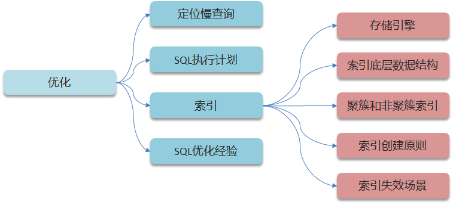

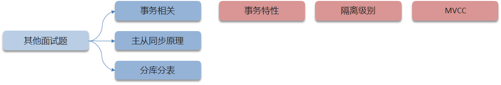

### 如何定位慢查询

我们当时做压测的时候有的接口非常的慢，接口的响应时间超过了4秒以上，因为我们当时的系统部署了运维的监控系统Skywalking ，在展示的报表中可以看到是哪一个接口比较慢，并且可以分析这个接口哪部分比较慢，这里可以看到SQL的具体的执行时间，所以可以定位是哪个sql出了问题

如果，项目中没有这种运维的监控系统，其实在MySQL中也提供了慢日志查询的功能，可以在MySQL的系统配置文件中开启这个慢日志的功能，并且也可以设置SQL执行超过多少时间来记录到一个日志文件中，我记得上一个项目配置的是2秒，只要SQL执行的时间超过了2秒就会记录到日志文件中，我们就可以在日志文件找到执行比较慢的SQL了。

### 那这个SQL语句执行很慢, 如何分析呢？

一条sql执行很慢可能是因为他是聚合查询、多表查询、表数据过大或者是深度分页查询，
聚合查询可以尝试新增一个临时表去解决，
多表查询可以试着去优化SQL结构，
如果是表数据过大查询，一般是添加索引，

如果一条sql执行很慢的话，我们通常会使用mysql自动的执行计划**explain**来去查看这条sql的执行情况，比如在这里面可以通过key和key_len检查是否命中了索引，如果本身已经添加了索引，也可以判断索引是否有失效的情况，第二个，可以通过type字段查看sql是否有进一步的优化空间，是否存在全索引扫描或全盘扫描，第三个可以通过extra建议来判断，是否出现了回表的情况，如果出现了，可以尝试添加索引或修改返回字段来修复

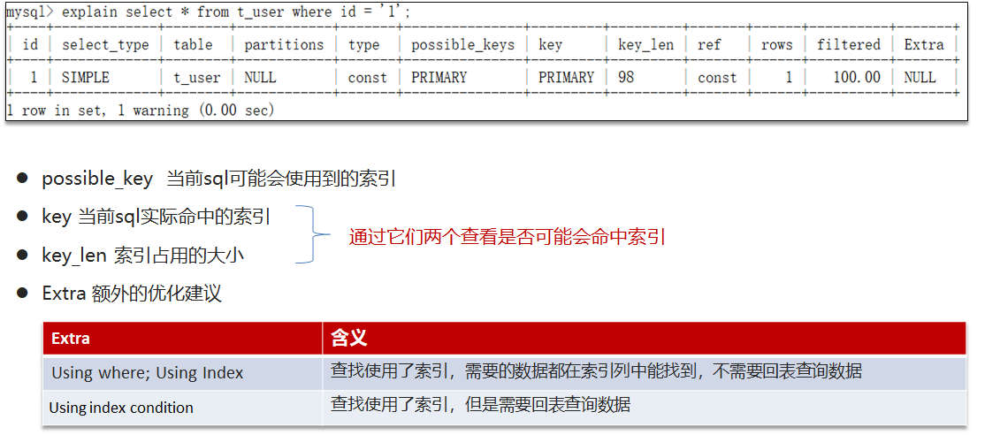

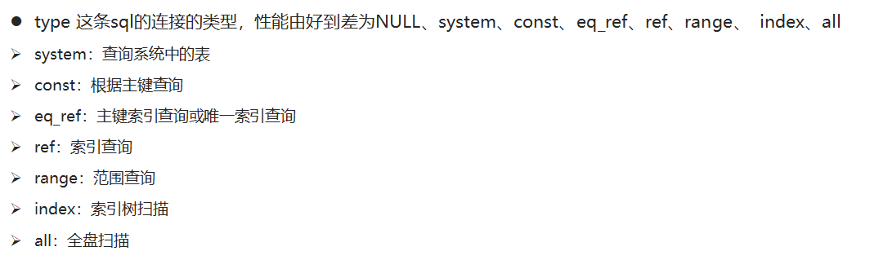

### 了解过索引吗？（什么是索引）

1.是帮助MySQL高效获取数据的（有序）数据结构，
2.主要是用来提高数据检索的效率，降低数据库的IO成本，
3.同时通过索引列对数据进行排序，降低数据排序的成本，也能降低了CPU的消耗。

### 索引的底层数据结构了解过吗？（B+树）

MySQL的InnoDB引擎采用的B+树的数据结构来存储索引

- 阶数更多，路径更短
- 磁盘读写代价B+树更低，非叶子节点只存储指针，叶子阶段存储数据
- B+树便于扫库和区间查询，叶子节点是一个双向链表

### B树和B+树的区别是什么？

1. 在B树中，叶子节点和非叶子节点都会存储数据，而B+树只会在叶子节点存放数据，在查询的时候，B+树的查找效率更加稳定
2. 在进行范围查询的时候，B+树效率更高，因为B+树的数据都存储在叶子节点，而且叶子节点是一个双向链表

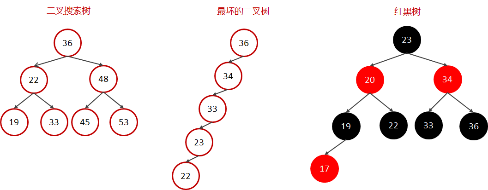

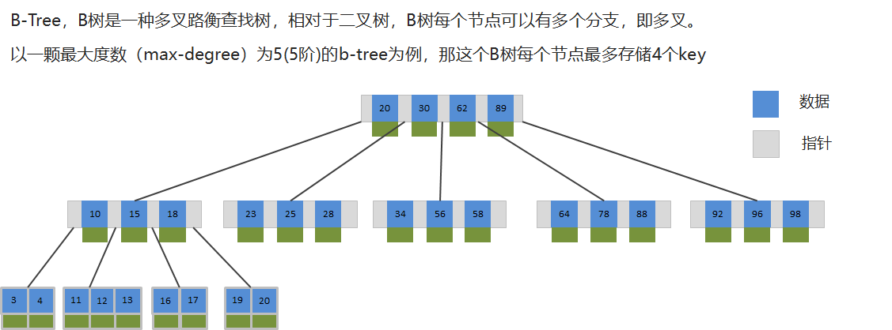

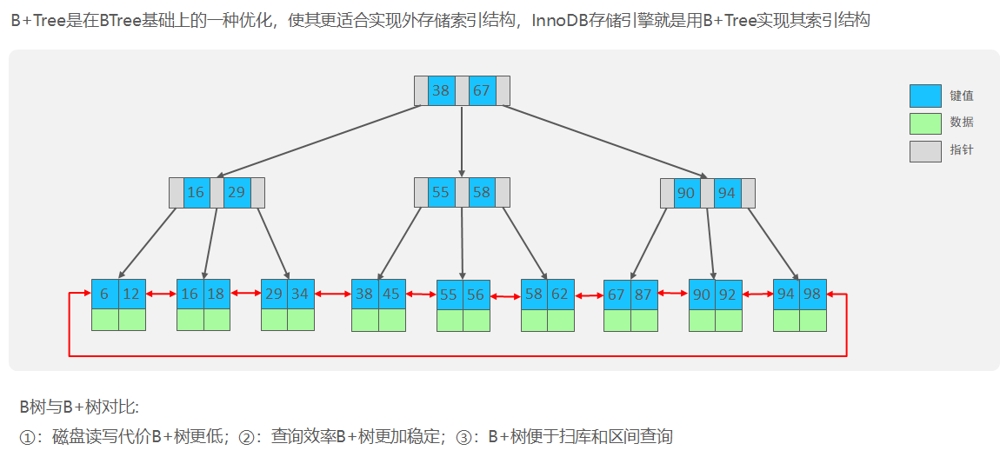

# Redis

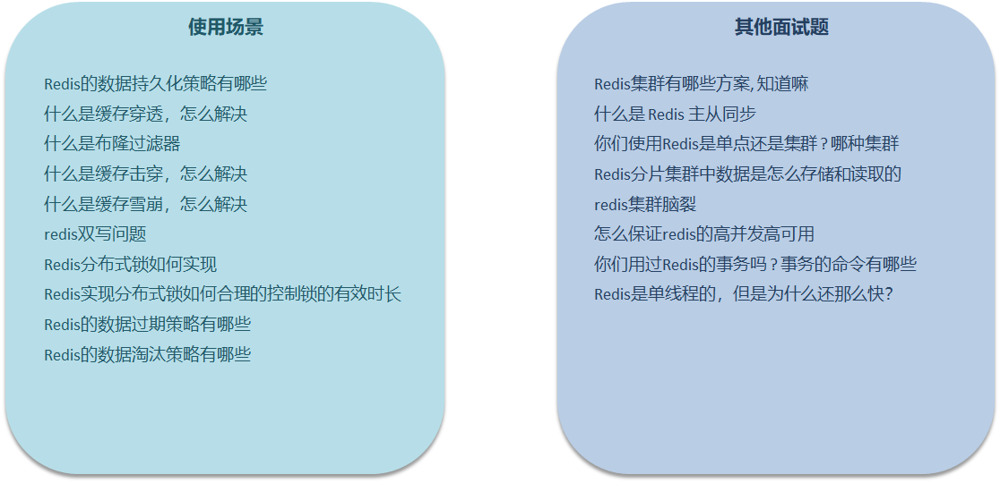

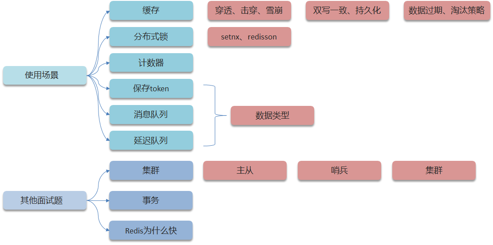

### 缓存

#### 穿透

#### 击穿

#### 雪崩

##### 什么是缓存雪崩

**缓存雪崩**是指在同一时段大量的缓存key同时失效或者Redis服务宕机，导致大量请求到达数据库，带来巨大压力。

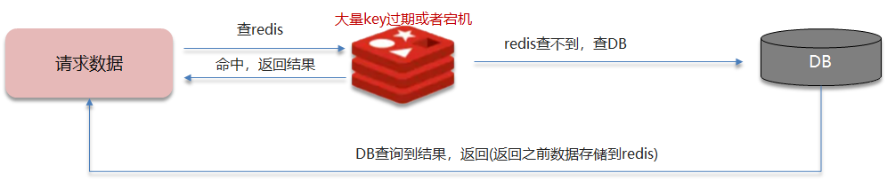

##### 解决方案

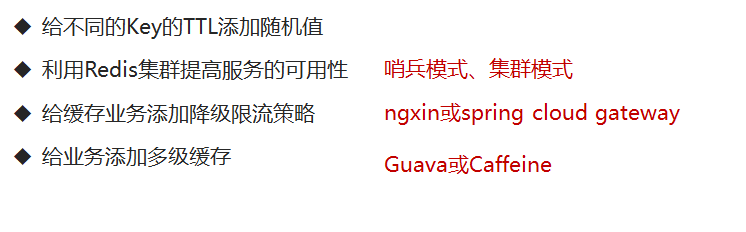

#### 双写一致

##### redis做为缓存，mysql的数据如何与redis进行同步呢？（双写一致性）

>当修改了数据库的数据也要同时更新缓存的数据，缓存和数据库的数据要保持一致

**高一致性业务**

我们当时是把抢券的库存存入到了缓存中，这个需要实时的进行数据同步，为了保证数据的强一致，我们当时采用的是redisson提供的**读写锁**来保证数据的同步

采用Redisson提供的读写锁
①共享锁：读锁readLock，加锁之后，其他线程可以共享读操作 
②排他锁：独占锁writeLock也叫，加锁之后，阻塞其他线程读写操作

**允许延迟业务**

介绍自己简历上的业务，我们当时是把文章的热点数据存入到了缓存中，虽然是热点数据，但是实时要求性并没有那么高，所以，我们当时采用的是**异步的方案同步的数据**

允许延时一致的业务，采用异步通知
①使用MQ中间件，更新数据之后，通知缓存删除
②利用canal中间件，不需要修改业务代码，伪装为mysql的一个从节点，canal通过读取binlog数据更新缓存

#### 持久化

**RDB**全称Redis Database Backup file（Redis数据备份文件），也被叫做Redis数据快照。简单来说就是把内存中的所有数据都记录到磁盘中。当Redis实例故障重启后，从磁盘读取快照文件，恢复数据

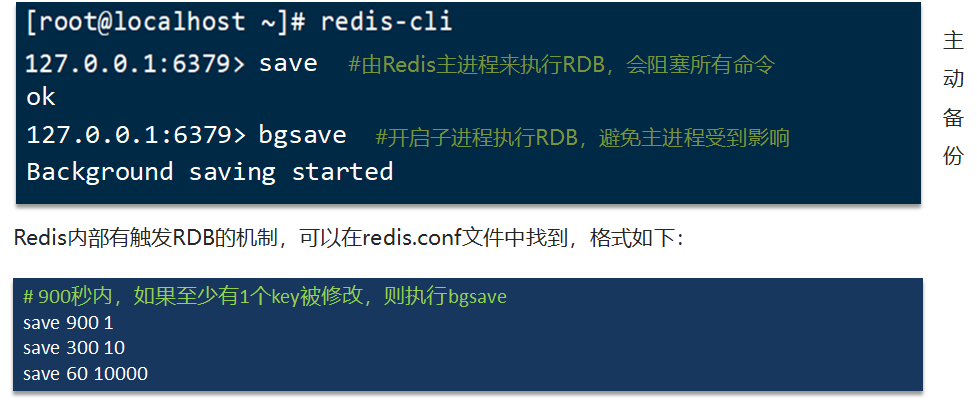

**AOF**全称为Append Only File（追加文件）。Redis处理的每一个写命令都会记录在AOF文件，可以看做是命令日志文件。

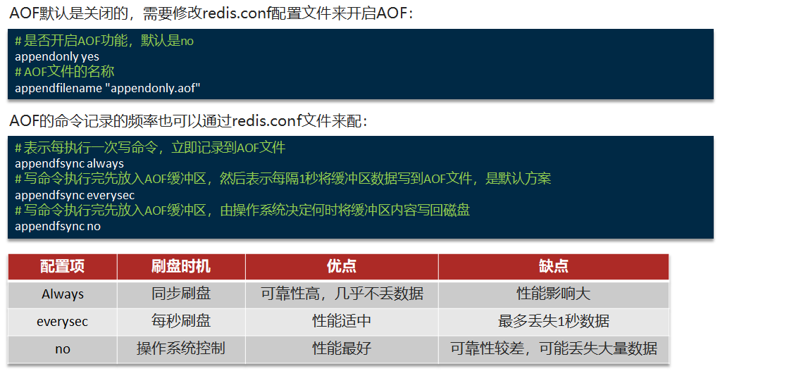

RDB和AOF各有自己的优缺点，如果对数据安全性要求较高，在实际开发中往往会**结合**两者来使用。

|                | **RDB**                                      | **AOF**                                                  |
| -------------- | -------------------------------------------- | -------------------------------------------------------- |
| 持久化方式     | 定时对整个内存做快照                         | 记录每一次执行的命令                                     |
| 数据完整性     | 不完整，两次备份之间会丢失                   | 相对完整，取决于刷盘策略                                 |
| 文件大小       | 会有压缩，文件体积小                         | 记录命令，文件体积很大                                   |
| 宕机恢复速度   | 很快                                         | 慢                                                       |
| 数据恢复优先级 | 低，因为数据完整性不如AOF                    | 高，因为数据完整性更高                                   |
| 系统资源占用   | 高，大量CPU和内存消耗                        | 低，主要是磁盘IO资源  但AOF重写时会占用大量CPU和内存资源 |
| 使用场景       | 可以容忍数分钟的数据丢失，追求更快的启动速度 | 对数据安全性要求较高常见                                 |

#### 数据过期

#### 淘汰策略

### 分布式锁

> 使用场景: 集群情况下的定时任务、抢单、幂等性场景